# **In Safe Hands** #

<!--  -->

## **Introduction** ##

In Safe Hands was created and built by Stephen Mc Govern as my 4th and final milestone project for my fullstack diploma in software development with Code Institute. The website is a Django e-commerce website for a company that provides different types of PPE products and equipment to the general public as well as several COVID-19 specific items. 

## **Table of contents** ## 

### **1. User Experience (UX)** ###
* 1.1 Target audience
* 1.2 Visitor goals
* 1.3 User stories
* 1.4 Design choices
* 1.5 Wire frames

### **2. Features** ###
* 2.1 Top header
* 2.1 Navbar

### **3. Technologies/Languages Used** ###
* 3.1 Gitpod
* 3.2 HTML5
* 3.3 CSS
* 3.4 JavaScript
* 3.5 JQuery
* 3.6 Python
* 3.7 Django
* 3.8 Bootstrap 
* 3.9 Google fonts
* 3.10 Font Awesome
* 3.11 W3schools
* 3.12 Balsamiq 
* 3.13 Favicon Generator

### **4. Testing** ###
* 4.1 See [testing.md](testing.md) document
* 4.2 Development Issues

### **5. Deployment** ###
* 5.1 Deployment & cloning

### **6. Credits** ###
* 6.1 Media
* 6.2 Code 
* 6.3 Acknowledgements

### **7. Contact Me** ###
* 7.1 LinkedIn
* 7.2 Email
* 7.3 Skype

### **8. Future Features To Develop** ###

### **9. Disclaimer** ###
* 9.0 Disclaimer on project

 

<strong>
1. User Experience (UX)
</strong>

 

#### **1.1 - Target Audience** ####

* The website is aimed at users who are looking to purchase various types of PPE equipment that the company provides. The website is a B2C (Business to consumer) website and is not aimed at the B2B (Business to business market) 

#### **1.2 - Visitor goals** #### 

* As a user of the site my goals are:

#### **1.3 - User Stories** ####

#### **1.4 - Design Choices** ####
 

**FONTS**

* For the website i decided to use the google font style of Josefin Sans. The idea of this typeface is to be geometric, elegant, with a vintage feeling. It is inspired by geometric sans serif designs from the 1920s. The link to the Josefin Sans font on Google Font can be found by clicking: [Here](https://fonts.google.com/specimen/Josefin+Sans#standard-styles)

**ICONS**

* I have also incorporated icons throughout the website as they offer the user a more positive and intuitive user experience. All the icons that i have used came from Font Awesome website The link to the Font Awesome website can be found by clicking: [Here](https://fontawesome.com/)

**COLOURS**

* The primary colour i decided on for the website was the colour blue, specifically the colour #1fb4ff

* 

* I chose the color blue because blue is typically associated with credibility, trust, knowledge, professionalism, cleanliness and calming. All of these qualities are valued in the medical/health industry which meant that blue was the ideal choice for this project.

* For the secondary colours i used the website Coolors to decide on which additional colour combination to use. Coolors is free website that uses a generator to run through different colours and palettes that will match and compliment the colours you have selected so far. The website can be found by clicking this link: [Click Here](https://coolors.co/)

* The full palette of colours i decided on to go with can be viewed below:

INSERT COLOUR PALLETTE HERE 

**IMAGES**

* All of the imagery i used for the website was taken from Unsplash. Unsplash is a platform powered by a community of creators that have provided hundreds of thousands of their own photos for others to use in their projects free of charge as long as they abide by the Unsplash licence terms and conditons. These T&C's can be viewed by clicking [Here](https://unsplash.com/license) 

#### **1.5 - Wire Frames** ####

<strong>
2. Features
</strong>

 

#### **2.1 - Top header** ####

* The top header on the page consists of 3 separate items. The company brand/logo occupies the top left 3rd of the screen. If the user clicks on the company brand/name the user will be be brought back to the homepage.

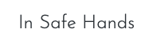

* The center of the screen is occupied by the search bar. Here users can search for items in the store by typing in a key/search word. If that word is in the name or description of the product then the page will return a list of those products for the user to view. If there are no items that match the search/keyword then no products will be displayed on the products page and the user will see the message 0 Products found for "(search/keyword)". If the user doesn't enter a search/keyword and just presses the search button then they will be brought to the all products page where all of the products available are listed. 

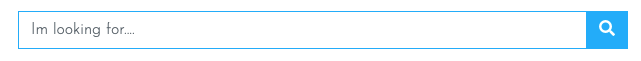

* The right hand side of the header is where the user login and shopping cart are located. Here users can see at a glance if anything is in their cart and if so the value of those items.

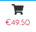

* If they click on the user icon they will, depending on if they are logged in or not, see different account management options. 

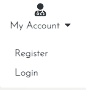

#### **2.2 - The Navbar** ####

* The navbar is a bootstrap navbar that contains 4 separate dropdown menus to allow users to easily navigate the site. The first dropdown is the one that will allow users to shop for different type of PPE products that the site offers.   

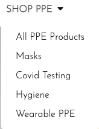

* The second dropdown item will bring users to the about us page where user can read a bit more information about the company.

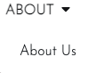

* The third dropdown is the one for up to date information on Covid-19.

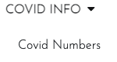

* The final dropdown will bring the users to the contact us page. 

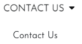

* On mobile devices the navbar will shrink and can be opened by the user if they click on the hamburger icon on the top left of the page. After clicking all of the items will again be visible for the user to navigate the site. 

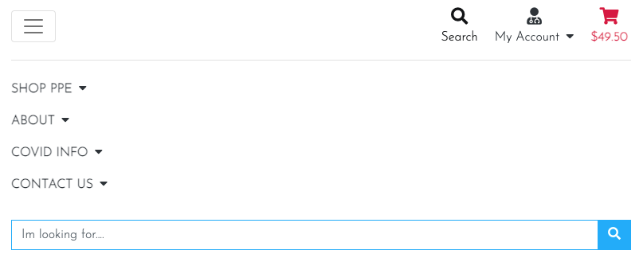

<strong>
3. Technologies/Languages Used
</strong>

 

* 3.1 - [Gitpod](https://www.gitpod.io/) - Is the IDE recommended for Code Institute students and the one i chose to develop this project in.
* 3.2 - [HTML5](https://html.com/html5/#What_is_HTML) - This is the markup language i used for this project. 
* 3.3 - [CSS](https://en.wikipedia.org/wiki/CSS) - I used CSS to help alter and adjust the presentation of the website to create a pleasant user experience. 
* 3.4 - [JavaScript](https://en.wikipedia.org/wiki/JavaScript) - JavaScript often abbreviated as JS, is a programming language that conforms to the ECMAScript specification. Alongside HTML and CSS, JavaScript is one of the core technologies of the World Wide Web. 
* 3.5 - [JQuery](https://jquery.com/) - jQuery is a fast, small, and feature-rich JavaScript library. It makes things like HTML document traversal and manipulation, event handling, animation, and Ajax much simpler with an easy-to-use API that works across a multitude of browsers.
* 3.6 - [Python](https://www.python.org/) - Python is an interpreted high-level general-purpose programming language. Python's design philosophy emphasizes code readability with its notable use of significant indentation. Its language constructs as well as its object-oriented approach aim to help programmers write clear, logical code for small and large-scale projects.
* 3.7 - [Django](https://www.djangoproject.com/) - Django is a high-level Python web framework that encourages rapid development and clean, pragmatic design. Built by experienced developers, it takes care of much of the hassle of web development, so you can focus on writing your app without needing to reinvent the wheel. It’s free and open source.
* 3.8 - [Bootstrap](https://getbootstrap.com/) - Bootstrap is a free and open-source CSS framework directed at responsive, mobile-first front-end web development. It contains CSS- and JavaScript-based design templates for typography, forms, buttons, navigation, and other interface components.
* 3.9 - [Google fonts](https://fonts.google.com/) - Launched in 2010 Google Fonts is a library of 1,023 free licensed font families. For this project i went with the google font of Josefin Sans.
* 3.10 - [Font Awesome](https://fontawesome.com/) - Font awesome is world's most popular and easiest to use icon set. Users have access to thousands of different icons that will cover nearly every icon you are looking for and incorporating them into your website is very easy. 
* 3.11 - [W3schools](https://www.w3schools.com/) - One of the first ports of call for any developer. It has a vast amount of content and code tutorials that will help explain how code works. A great free resource for every developer. 
* 3.12 - [Balsamiq](https://balsamiq.com/) - Balsamiq Wireframes is a small graphical tool to sketch out user interfaces for websites and web / desktop / mobile applications. I used Balsamiq to formulate my initial ideas for the site so i could visualize how the site would look and also be able to gage the scope of the project. 
* 3.13 - [Favicon](https://favicon.io/favicon-generator/) - A free and simple website that allows you to create, build and customize your Favicons for your own site.

<strong>
4. Testing
</strong>

 

#### **4.1 The testing.md file** ####

* Testing information can be found in the [testing.md](testing.md) file.

#### **4.2 Development Issues** ####
 

**1. SECRET_KEY Issue**

**PROBLEM**

* When I began building the project I started to make commits to Github. After making some commits I received an email from Django saying I had inadvertently exposed my secret key. The email I received is below. 

* "GitGuardian has detected the following Django Secret Key exposed within your GitHub account."

Details
- Secret type: Django Secret Key
- Repository: smcgdub/MS4_In_Safe_Hands
- Pushed date: September 6th 2021, 16:42:54 UTC

#### **Solution** ####

* To rectify this I discarded the secret key that was initially created during the project set up. I then replaced the secret key with the code on line 25 of the settings.py file which is: `SECRET_KEY = os.environ.get('SECRET_KEY')`

* I then created a brand new secret key and have stored this in my Gitpod variables. I stopped and restarted the workspace and ran the project using `python3 manage.py runserver` Everything is now running as normal and the new SECRET_KEY is secured and no longer exposed and the old one has been discarded. 

**2. Toasts Issue**

**PROBLEM**

* During development i was going to use the Bootstrap toasts to provide feedback to a user when they completed various actions on the site. The Boutique Ado project provided some tutorials on how to install these. However when i followed the Boutique Ado tutorial i found that my toasts were not being displayed when i added an item to the shopping cart.

**SOLUTIONS TRIED**

* The first thing i did was to inspect the page after adding an item to the checkout to see if the element was being generated. The 2 screenshots below confirmed that the elements were in fact being generated. 

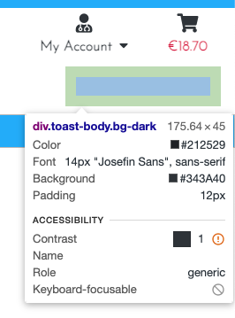

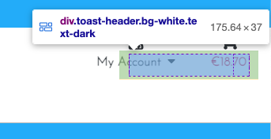

* The screenshot below also shows that the item was added to the cart and the information was being generated, but just wasn't displaying. 

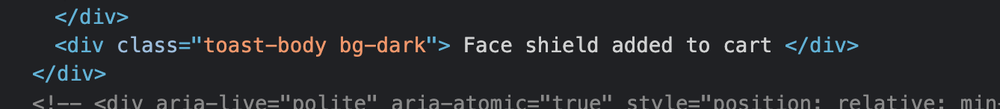

* Once i knew the element was being generated i looked on Google and Bootstrap as to why this might not have been generated. I also checked on slack. After speaking with tutor support the solution we found was i needed th change the ``

I have tested the site and this appears to have resolved the issue. The toasts are displaying as normal. 

<strong>
5. Deployment
</strong>

<strong>
6. Credits
</strong>

 

#### **6.1 Media** ####

The products PNG images i have sourced from various free PNG sites. The individual list of the images can be found below

**PRODUCTS**

* **N95 Mask** 
Link to the original image: [Here](https://www.pngwing.com/en/free-png-itipy)
All credits belongs to the owner of the image (DMCA) and the image is provided under non-commercial use

* **KN95 Mask** 
Link to the original image: [Here](https://www.pngwing.com/en/free-png-vcpqz)
All credits belongs to the owner of the image (DMCA) and the image is provided under non-commercial use

* **Surgical Mask** 
Link to the original image: [Here](https://www.pngwing.com/en/free-png-vwteu)
All credits belongs to the owner of the image (DMCA) and the image is provided under non-commercial use

* **Face Shield** 
Link to the original image: [Here](https://pngtree.com/freepng/medical-face-mask-or-shield-realistic-plastic-face-shield-side-view-transparent-plastic-helmet-covid-19-quarantine-concept_5390600.html)
 
All credits belongs to the owner of the image (Me&Art) whose profile can be found [Here](https://pngtree.com/me%26art_6843833?type=1)

* **Rapid Antigen Test** 
Link to the original image: [Here](https://pngtree.com/freepng/coronavirus-test-used-to-detect-the-corona-virus-in-humans_5870822.html)
 
All credits belongs to the owner of the image (Iwan100) whose profile can be found [Here](https://pngtree.com/iwan100_28265876?type=1)

* **Rapid PCR Test** 
Link to the original image: [Here](https://pngtree.com/freepng/rapid-test_6581523.html)
 
All credits belongs to the owner of the image (Best Pixel) whose profile can be found [Here](https://pngtree.com/best-pixel_32692878?type=1)

* **Infrared Thermometer** 
Link to the original image: [Here](https://pngtree.com/freepng/infrared-thermometer-design-vector-cartoon_5510126.html)
 
All credits belongs to the owner of the image (p4pranstudio) whose profile can be found [Here](https://pngtree.com/p4pranstudio_18640515?type=1)

* **Disposable Gloves** 
Link to the original image: [Here](https://www.pngwing.com/en/free-png-viuej)
 
All credits belongs to the owner of the image (DMCA) and the image is provided under non-commercial use

* **Disposable Gown** 
Link to the original image: [Here](https://www.pngwing.com/en/free-png-xfpch)
 
All credits belongs to the owner of the image (DMCA) and the image is provided under non-commercial use

* **Hand Sanitizer** 
Link to the original image: [Here](https://www.pngwing.com/en/free-png-texpw)
All credits belongs to the owner of the image (DMCA) and the image is provided under non-commercial use

* **75% Alcohol wipes** 
Link to original image: [Here](https://pngtree.com/freepng/yellow-and-blue-contrast-disinfection-wipes-3d-element_5487423.html)
 
All credit belongs to the owner of the image (Air), whose profile can be found [Here](https://pngtree.com/air_14779142?type=1)

#### **6.2 Code** ####

* All of the data on the covid numbers page is provided by Our World In Data. All credit for the charts, map, table and daily statistics goes to Our World Data who allow for the reproduction of this data free of charge once it is credited and the source is listed. The original link to the source of the data can be found by clicking here: https://ourworldindata.org/grapher/daily-covid-cases-deaths?tab=map&country=~OWID_WRL 

#### **6.3 Acknowledgements** ####

* Thank you to all of the tutor team at Code Institute who were always on hand whenever i needed their support.
* A big thank you to my mentor Dick Vlaanderen who always gives me great feedback on my ideas and is able to point me in the right direction.
* A final big thank you to all of the other students, CI alumni and CI staff who were always willing to help out and advise on the official CI Slack channels.

<strong>
7. Contact Me
</strong>

 
If you need to reach me i can be contacted via the three methods below:

* 7.1 - [LinkedIn](https://www.linkedin.com/in/stephenmcgovern01/)
* 7.2 - [Email](mailto:stephen_xyz1@hotmail.com) 
* 7.3 - [Skype](https://join.skype.com/invite/ndruMu7qVuKZ)

<strong>
8. Future Items To Develop
</strong>

<strong>
9. Disclaimer
</strong>

 

* This website and all of its content was completed for my final assessment project with Code Institute. The site is strictly for educational purposes only.

