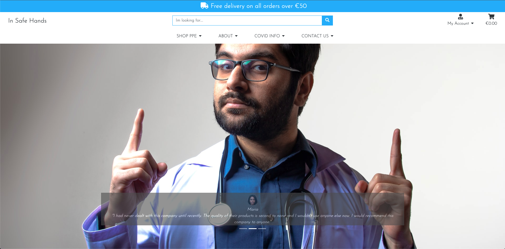
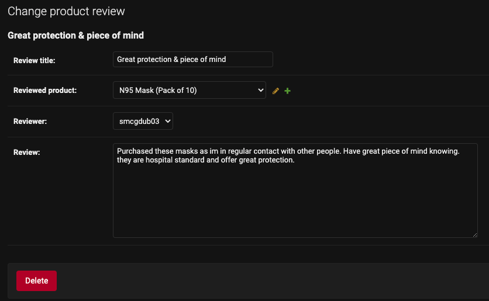
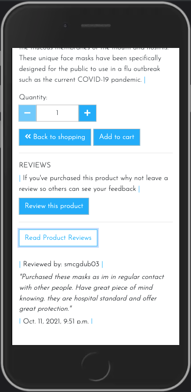
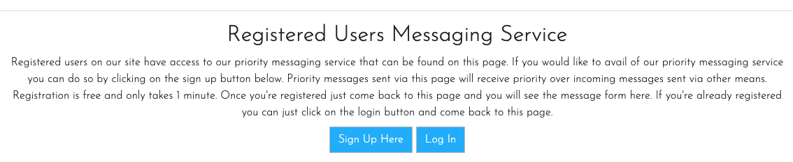
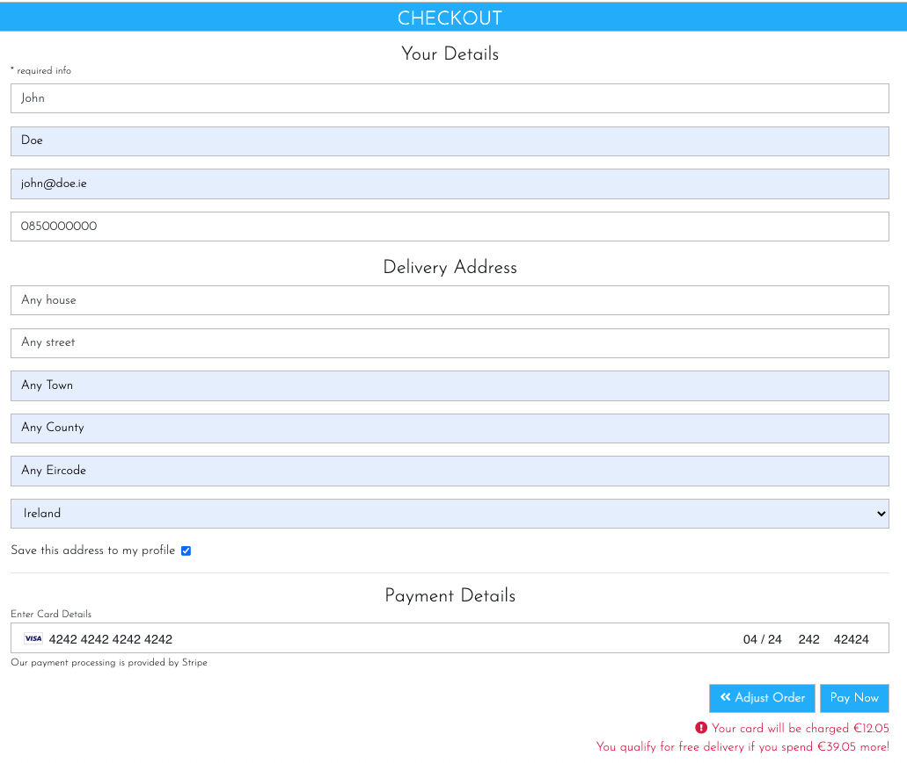
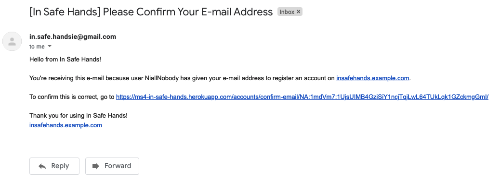

# **In Safe Hands** #

## **Introduction** ##

In Safe Hands was created and built by Stephen Mc Govern as my 4th and final milestone project for my fullstack diploma in software development with Code Institute. The website is a Django e-commerce website for a company that provides different types of PPE products and equipment to the general public as well as several COVID-19 specific items. Users of the site are able to purchase products whether they are registered users or if they wish to checkout as a guest. Registered users however benefit from more access to certain features on the site than none registered users.

**IMPORTANT NOTE:**

In this project upon submission, in the main settings.py file, Debug is currently set to False, which is a requirement as part of the assessment for this project. If the assessor attempts to run this project in the local environment by running the command `python3 manage.py runserver` and then opening the project in the browser on port 8000 the page will load with no images or css applied. If you wish to see the site in the local environment with all the imagery and css applied then Debug must be set to Debug = True. Open the project and do a hard reset of the browser for the css and images to now render. I have checked with tutor support at Code Institute and they told me that this is normal. I have noted this here just to make sure the assessor is aware of the Debug setting. 

## **Table of contents** ## 

### **1. User Experience & The 5 Planes Of UX** ###
* 1.1 Target audience - The Strategy Plane
* 1.2 User stories - The Scope Plane & - The Structure Plane
* 1.3 Design choices - The Surface Plane
* 1.4 Wire frames - The Skeleton Plane
* 1.5 Database Design - The Skeleton Pane

### **2. Features** ###
* 2.1 Homepage 
* 2.2 Top header
* 2.3 Navbar
* 2.4 The Shop Page
* 2.5 Product Details
* 2.6 Product Review
* 2.7 About Us
* 2.8 Covid Numbers
* 2.9 Contact Us & Registered User Messages
* 2.10 The Profile
* 2.11 The Shopping Cart
* 2.12 The Checkout Page
* 2.13 Purchase Complete
* 2.14 Stripe 
* 2.15 Sign Up & Real Emails
* 2.16 Login
* 2.17 Toasts

### **3. Technologies/Languages Used** ###
* 3.1 Gitpod
* 3.2 HTML5
* 3.3 CSS
* 3.4 JavaScript
* 3.5 JQuery
* 3.6 Python
* 3.7 Django
* 3.8 Bootstrap 
* 3.9 Google fonts
* 3.10 Font Awesome
* 3.11 W3schools
* 3.12 Balsamiq 
* 3.13 Favicon Generator
* 3.14 Stripe 
* 3.15 Heroku

### **4. Testing** ###
* 4.1 See [testing.md](testing.md) document 
* 4.2 Development Issues

### **5. Deployment** ###
* 5.1 Deployment & cloning

### **6. Credits** ###
* 6.1 Media
* 6.2 Code 
* 6.3 Acknowledgements

### **7. Contact Me** ###
* 7.1 LinkedIn
* 7.2 Email
* 7.3 Skype

### **8. Future Features To Develop** ###
* 8.1 - Social media login
* 8.2 - Social media share buttons
* 8.3 - Paypal Payment Option
* 8.4 - Wishlist
* 8.5 - Sort by price functionality
* 8.6 - Dark Mode
* 8.7 - Shopping Cart

### **9. Disclaimer** ###
* 9.0 Disclaimer on project

 

<strong>
1. User Experience (UX)
</strong>

 

#### **1.1 - Target Audience - The Strategy Plane** ####

* The websites target audience is users who are looking to purchase various types of PPE equipment that the store provides. The website is a B2C (Business to consumer) website and is not aimed at the B2B (Business to business) market. The main goal of the business is to sell various type of PPE equipment to as many people as possible. Part of the business strategy is to keep users coming back to the site even if they are not buying a product on that particular visit. The more times someone visits your site, the greater the chance of them purchasing something from the store. Part of the strategy of getting users to return to the site is the covid numbers page that gives users a vast amount of user friendly interactive data on the current covid situation. This data while free to view and use, is kept behind a registered users wall, so anyone wishing to use it has to register to view it. The data is not generated by the store, but is compiled by our world in data. I recognize the potential that someone may register, view the data source and then start to use the our world in data site instead of the in safe hands site, but this is unavoidable when using 3rd party data. 

#### **1.2 - User Stories - The Scope Plane** ####

* The main aim of the site is to sell various types of PPE equipment to the consumer market. Users who search for, and come to the site are, for the majority, already in buying mode. Therefore you want to facilitate a streamline buying experience with as few barriers as possible from product view to taking payment. The site functionality will allow users to view all of the products on the site in detail, proceed straight to a guest checkout where they can to complete the order if they so wish. The site also offers features that are only available to registered users such as the profile page, the order history page, the create reviews functionality, and the the priority messages feature. While the site offers features that are only available to logged in users, it will not lose sales by forcing people to register to complete a purchase.  
* <strong>User story - Site Owner: As the owner of the e-commerce site I want:</strong> 
* I want to be able to offer my customers a range of various types of PPE products so i can: acquire new customers and retain regular ones who will buy their PPE products from me
* I want to be able to manage all of the items that my store sells myself so i can: Add, edit, update and remove different items quickly and easily depending on how they are selling 
* I want to offer my customers a simple, efficient and user friendly shopping experience so i can: Offer users have a good user experience on the site they will come back and provide repeat business
* I want to offer registered customers access to the latest Covid-19 data all in one place so i can: offer users a reason to come back to the site on a regular basis, they need to register to view this data so this allows me to send them email marketing to encourage them to buy and to update them on the store
* I want to encourage my users to register so i can: so they can save their details and streamline the purchasing process. Once they have registered I can also email market to this database of customers
* I want to provide a guest checkout so i can: offer users who do not wish to register the ability to still purchase from the store and checkout out in a quick and easy manner so the store doesn’t lose any potential business

#### **1.2 - User Stories - The Structure Plane** ####

* The structure of the site is based upon a base.html template that is replicated across all pages on the site. In the English speaking world people read from left to right and from top to bottom. Therefore the website should reflect this. On every page all of the site navigation is retained at the top of the page. This creates a comfortable user experience as once a user has a feel for the sites navigation and functionality, they can see it is replicated across the site, they are not confronted with a new layout or design on each page. The Navar is broken up into 4 separate categories. Shop PPE, About Us, Covid Info, and Contact Us. As the main aim of the site is to sell PPE equipment the first dropdown menu the user comes to is the Shop PPE menu. From here the user can view all of the PPE products or view them category by category. The about us, covid info and contact us pages contain only information on these items so the information is all grouped into relevant sub pages. The account management is all navigated to via the "My Account" drop down menu, and the shopping cart and checkout from the cart. When designing the sites structure, the user stories below were part of that formation process.  
* <strong>User story - Site User: As a shopper on the site I want to:</strong> 
* I want to view all of the products in the store so i can: select a product to purchase
* I want to view individual products and their details so i can: identify the price, description, product protection rating, see the product image
* I want to, at a glance, be able to keep track of my purchases at any time on the site so i can: keep track of the value of goods in my cart so i can avoid spending to much money
* I want to be able to register for an account quickly and easily so i can: have a personal account on the site if I become a regular user
* I want to be able to log in and log out quickly and easily so i can: know my account can be securely logged on and off with only a few clicks. 
* I want to be able to recover my password simply if I forget it so i can: regain access to my account 
* I want to view my profile when i wish so i can: see my order history and order details 
* I want to search for a specific product or category so i can: quickly find the item that I am looking for 
* I want to easily select the quantity of a product once I have chosen to buy it so i can: add more of the product to the cart if I choose to buy more with a few clicks 
* I want to be offered a quick and easy checkout procedure so i: don’t have to register for an account if I don’t want to and still avail of a quick and easy checkout process 
* I want to be able to fully adjust my cart before checkout: incase I decide to buy more or a product, remove a product, or have selected the incorrect amount of a product
* I want to see an order confirmation in detail once ive completed my purchase so i can: verify that everything with my order is correct
* Most importantly I want to be able to use a payment provider I feel safe with so i can: feel safe and secure that my card details will be safe with this purchase  

#### **1.3 - Design Choices - The Surface Plane** ####
 

**FONTS**

* For the website i decided to use the google font style of Josefin Sans. The idea of this typeface is to be geometric, elegant, with a vintage feeling. It is inspired by geometric sans serif designs from the 1920s. The link to the Josefin Sans font on Google Font can be found by clicking: [Here](https://fonts.google.com/specimen/Josefin+Sans#standard-styles)

**ICONS**

* I have also incorporated icons throughout the website as they offer the user a more positive and intuitive user experience. All the icons that i have used came from Font Awesome website The link to the Font Awesome website can be found by clicking: [Here](https://fontawesome.com/)

**COLOURS**

* The primary colour i decided on for the website was the colour blue, specifically the colour #1fb4ff

* I chose the color blue because blue is typically associated with credibility, trust, knowledge, professionalism, cleanliness and calming. All of these qualities are valued in the medical/health industry which meant that blue was the ideal choice for this project.
* For the secondary colours i used the website Coolors to decide on which additional colour combination to use. Coolors is free website that uses a generator to run through different colours and palettes that will match and compliment the colours you have selected so far. The website can be found by clicking this link: [Click Here](https://coolors.co/)
* The full palette of colours i decided on to go with and their uses can be viewed below:

* #343A40 is the colour of the text on the site. This is the Bootstrap 4 colour for the class text-dark as Bootstrap 4 doesn't have a text-black colour
* #c3c1c1 is the silver/grey secondary colour that is used lightly throughout the site for things like borders
* #ffffff is the standard white colour that is the base of the site 
* #dc3545 is the standard Bootstrap red colour for warnings suck as invalid credit card information entered or warning toasts 

**IMAGES**

* Some of the imagery i used for the website was taken from Unsplash. Unsplash is a platform powered by a community of creators that have provided hundreds of thousands of their own photos for others to use in their projects free of charge as long as they abide by the Unsplash licence terms and conditions. These T&C's can be viewed by clicking [Here](https://unsplash.com/license) 

#### **1.4 - Wire Frames - The Skeleton Plane** ####
 

* The wire frames for the site can be found here: [wireframes.md](wireframes.md)

#### **1.5 - Database Design - The Skeleton Plane** ####
 

* Django works with SQL databases by default, I used SQLite during development. Heroku provides a PostgreSQL database for deployment. Below you can find all of the models used in this project and also a visualization of the database schema and its relationships and structure. 

* **The Database Schema**

* **The Models**

<strong>Checkout/Models/`Order`:</strong>

| Name              | Database Key    | Field Type    | Type Validation                                                                      |
|-------------------|-----------------|---------------|--------------------------------------------------------------------------------------|
| Order Number      | order_number    | CharField     | `max_length=32, null=False, editable=False`                                            |
| User              | user_profile    | ForeignKey    | `UserProfile, on_delete=models.SET_NULL, null=True, blank=True, related_name='orders'` |
| Date & Time       | date            | DateTimeField | `auto_now_add=True`                                                                    |
| First Name        | first_name      | CharField     | `max_length=50, null=False, blank=False`                                               |
| Last Name         | last_name       | CharField     | `max_length=50, null=False, blank=False`                                               |
| Full Name         | full_name       | CharField     | `max_length=100, null=True, blank=True`                                                |
| Email             | email           | EmailField    | `max_length=254, null=False, blank=False`                                              |
| Phone Number      | phone_number    | CharField     | `max_length=20, null=False, blank=False`                                               |
| Street Address 1  | street_address1 | CharField     | `max_length=80, null=False, blank=False`                                               |
| Street Address 2  | street_address2 | CharField     | `max_length=80, null=False, blank=False`                                               |
| Town or City      | town_or_city    | CharField     | `max_length=40, null=False, blank=False`                                               |
| County            | county          | CharField     | `max_length=80, null=True, blank=True`                                                 |
| Eircode           | eircode         | CharField     | `max_length=20, null=True, blank=True`                                                 |
| Country           | country         | CharField     | `blank_label='Select Country *', null=False, blank=False`                              |
| Delivery          | delivery_cost   | DecimalField  | `max_digits=6, decimal_places=2, null=False, default=0`                               |
| Order Total       | order_total     | DecimalField  | `max_digits=10, decimal_places=2, null=False, default=0`                               |
| Grand Total       | grand_total     | DecimalField  | `max_digits=10, decimal_places=2, null=False, default=0`                               |
| Original Cart     | original_cart   | TextField     | `null=False, blank=False, default=''`                                                  |
| Stripe Payment ID | stripe_pid      | CharField     | `max_length=254, null=False, blank=False, default=''`                                  |
 

<strong>Checkout/Models/`OrderLineItem`:</strong>

| Name            | Database Key   | Field Type   | Type Validation                                                                      |
|:-----------------|:----------------|:--------------|:--------------------------------------------------------------------------------------|
| Order           | order          | ForeignKey   | `Order, null=False, blank=False, on_delete=models.CASCADE, related_name='lineitems'` |
| Product         | product        | ForeignKey   | `Product, null=False, blank=False, on_delete=models.CASCADE`                         |
| Quantity        | quantity       | IntegerField | `null=False, blank=False, default=0`                                                 |
| Line Item Total | lineitem_total | DecimalField | `max_digits=6, decimal_places=2, null=False, blank=False, editable=False`            |

 

<strong>Contact Us/Models/`ContactMessages`:</strong>

| Name          | Database Key  | Field Type    | Type Validation                                                |
|:---------------:|:---------------:|:---------------:|----------------------------------------------------------------|
| Sender        | sender        | ForeignKey    | `UserProfile, on_delete=models.CASCADE, null=True, blank=True` |
| Subject       | subject       | CharField     | `max_length=80, null=False, blank=False`                       |
| Message       | message       | TextField     | `max_length=3000, null=False, blank=False`                     |
| Date & Time   | date          | DateTimeField | `auto_now_add=True, editable=False`                            |
| Contact Email | contact_email | EmailField    | `max_length=254, null=True, blank=True`                        |

 

<strong>Products/Models/`Category`:</strong>

|      Name     |  Database Key | Field Type |             Type Validation            |
|:-------------:|:-------------:|:----------:|:--------------------------------------:|
|      Name     |      name     |  CharField |      `max_length=200, blank=False`     |
| Friendly Name | friendly_name |  CharField | `max_length=200, null=True,blank=True` |

 

<strong>Products/Models/`Product`:</strong>

| Name              | Database Key | Field Type   | Type Validation                                                |
|-------------------|--------------|--------------|----------------------------------------------------------------|
| Category          | category     | ForeignKey   | `'Category', null=True, blank=True, on_delete=models.SET_NULL` |
| Product Id        | p_id         | CharField    | `max_length=200, null=True, blank=True`                        |
| Name              | name         | CharField    | `max_length=200`                                               |
| Description       | description  | TextField    |                                                                |
| Price             | price        | DecimalField | `max_digits=6, decimal_places=2`                               |
| Protection Rating | rating       | DecimalField | `max_digits=6, decimal_places=2, null=True, blank=True`        |
| Image URL         | image_url    | URLField     | `max_length=1024, null=True, blank=True`                       |
| Image             | image        | ImageField   | `null=True, blank=True`                                        |

 

<strong>Products/Models/`UserProfile`:</strong>

| Name                     | Database Key            | Field Type    | Type Validation                                       |
|--------------------------|-------------------------|---------------|-------------------------------------------------------|
| User                     | user                    | OneToOneField | `User, on_delete=models.CASCADE`                      |
| Default Email            | default_email           | EmailField    | `max_length=254, null=True, blank=True`               |
| Default Phone number     | default_phone_number    | CharField     | `max_length=20, null=True, blank=True`                |
| Default Street Address 1 | default_street_address1 | CharField     | `max_length=80, null=True, blank=True`                |
| Default Street Address 2 | default_street_address2 | CharField     | `max_length=80, null=True, blank=True`                |
| Default Town Or City     | default_town_or_city    | CharField     | `max_length=40, null=True, blank=True`                |
| Default County           | default_county          | CharField     | `max_length=80, null=True, blank=True`                |
| Default Eircode          | default_eircode         | CharField     | `max_length=20, null=True, blank=True`                |
| Default Country          | default_country         | CountryField  | `blank_label='Select Country', null=True, blank=True` |                                       |

 

<strong>Reviews/Models/`ProductReview`:</strong>

|       Name       |   Database Key   |   Field Type  |                          Type Validation                         |
|:----------------|:----------------|:-------------|:----------------------------------------------------------------|
|   Review Title   |   review_title   |   CharField   |             `max_length=90, null=False, blank=False`             |
| Reviewed Product | reviewed_product |   ForeignKey  |   `Product, null=False, blank=False, on_delete=models.CASCADE`   |
|     Reviewer     |     reviewer     |   ForeignKey  | `UserProfile, null=False, blank=False, on_delete=models.CASCADE` |
|      Review      |      review      |   TextField   |                         `max_length=500`                         |
|    Date & Time   |       date       | DateTimeField |                        `auto_now_add=True`                       |
 

<strong>
2. Features
</strong>

 

#### **2.1 - Home Page** ####

* When the user lands on the homepage they will see the main homepage image which is of a doctor. In this image the doctor is pointing upwards towards the top of the page with the forefinger on each hand. I choose this image specifically because i thought it worked well as the doctor appears to be pointing towards towards the dropdown menu and the search bar located above the image, so at a glance its like he is drawing your attention to the main functioning part of the page. 

* At the base of the page i have used a bootstrap carousel to display 3 reviews that customers have left about the site. On these carousels i have used an image of a person (To represent the customer) and their brief review. I have also used indicators letting users see visually below the review that there are 3 reviews in total that are being filtered through. I have disabled click feature so users don't have the ability to click through the reviews, the reviews are on a set timer and rotate evenly.

#### **2.2 - Top header** ####

* The top header on the page consists of 3 separate items. The company brand/logo occupies the top left 3rd of the screen. If the user clicks on the company brand/name the user will be be brought back to the homepage.

* The center of the screen is occupied by the search bar. Here users can search for items in the store by typing in a key/search word. If that word is in the name or description of the product then the page will return a list of those products for the user to view. If there are no items that match the search/keyword then no products will be displayed on the products page and the user will see the message 0 Products found for "(search/keyword)". If the user doesn't enter a search/keyword and just presses the search button then they will be brought to the all products page where all of the products available are listed. 

* The right hand side of the header is where the user login and shopping cart are located. Here users can see at a glance if anything is in their cart and if so the value of those items. When the shopping cart is empty the cart test will be black. When the user adds an item to the shopping cart the value of those items will be displayed on the cart in red. I choose to make the text red as it is more catching and it will stand out clearly against the black. 

* If the user clicks on the My Account icon they will, depending on if they are logged in or not, see different account management options. A none logged in user will see the the option to register or to log in. (Screenshot Below)

* A logged in user will see the options to view their profile, and to logout.

* An admin or superuser will see the same options as a logged in user however they will also see the option to Add Products to the store. Only superusers and admin staff have this functionality. (Screenshot below)

#### **2.3 - The Navbar** ####

* The navbar is a bootstrap navbar that contains 4 separate dropdown menus to allow users to easily navigate the site. The first dropdown is the one that is for the store and will allow users to search for different types of PPE products that the site offers. Users can search for all the PPE equipment on one single page, or search via category of items the store sells.

* The second dropdown item will bring users to the about us page where user can read a bit more information about the company. This is just a standard about us page one would expect. 

* The third dropdown is the one for up to date information on Covid-19.

* The final dropdown will bring the users to the contact us page. 

* On mobile devices the navbar will shrink and can be opened by the user if they click on the hamburger icon on the top left of the page. After clicking all of the items will again be visible for the user to navigate the site. 

#### **2.4 - The Shop Page** ####

* Users to the site have the ability to shop in a number of different ways on the site. The first way is using the search bar at the top of the page. Here users can search for products via a products name, or by a key word that is mentioned in the products description. The page will return the number of products that meet that search criteria and also display the number of items its returned in the top left above the items (Screenshot below)

* The second way users can shop is via the SHOP PPE dropdown menu in the navbar. Here all of the items the shop sells are broken up into their respective categories, so users can quickly and easily search for what they need with a few clicks. 

* After the user clicks on a category the page will render all of the products in that category and also display the number of products in that category. The image below is what is displayed if the user searches for "covid testing" 

* Finally if the user just clicks on the search button on the search bar without entering anything to search for then all of the products the store currently sells will be listed 

#### **2.5 - Product Details Page** ####

* The product details page gives users a detailed view of the product they are considering buying. The page will render the exact same for each product, only the product information will change to allow for a better user experience. Logged in users and guest users will see the same page layout apart from one difference, and that is logged in users will see the "Review This Product" button. On the product details page users will see:
1. Product Name 
2. Product Price
3. Protection level offered by the product
4. Product Category
5. Product Description
6. Read the reviews

The functionality on this page will: 
1. Allow users to add a specified quantity of a product to the cart
2. Post reviews (Logged in users only) 

Admin users will also have the ability to:
1. Edit a product
2. Delete a product 

* The page will maintain its structure on tablets (Screenshots below:) 

 

However on smaller mobile devices and mobile phones the product information will stack one section on top of the other segregated by section type (Screenshots below:) 

 

#### **2.6 - Product Review Page** ####

* One of the pass criteria for this project was to: 

* <strong>"Implement at least 1 form, with validation, that allows users to create and edit models in the backend"</strong>

* The feature i have chosen for this is criteria is a registered users product review feature. A product review feature is something that most users expect to find on a modern e-commerce website. A review feature is a benefit to both customers and the store owner alike. When a store offers customers a review function it creates a better user engagement experience on your site. It allows users to leave feedback about what they thought about the product they have purchased. The review feature also lets the user know that their feedback is valued and is listened to. This feature also allows other potential customers to make a better buying decision based on the reviews of other users who have purchased the product. Finally it also allows the store owner to view the feedback each product is receiving. Store owners should never be afraid of a negative review, if a review is negative but constructive it will highlight a weak point that can be improved upon and the store owner will know they have 2 options. Firstly they can relay this feedback back to the manufacturer/supplier and see if it is possible ot improve the product, or if this is not an option, then the store owner can discontinue selling the product. 

* Anyone on the site will have the ability to read reviews, but to drive registration and sign ups, creating a review is only available to registered users who are logged in. On the product details page a none logged in user will see the following prompt under the reviews section  <strong>"Have you purchased this product? If you are a registered/logged in user then you can leave a review for this item and let others know your feedback. Login or register by clicking on the My Account icon on the top right of the page."</strong>

* However logged in users will see a different prompt. The prompt they will see is: <strong>"If you've purchased this product why not leave a review so others can see your feedback"</strong> (Screenshot below:)

* The review page is based on the ProductReview model. That model can be found below:

`class ProductReview(models.Model):` 
&nbsp; &nbsp; &nbsp; `review_title = models.CharField(max_length=90, null=False, blank=False)` 
&nbsp; &nbsp; &nbsp; `reviewed_product = models.ForeignKey(Product, null=False, blank=False, on_delete=models.CASCADE,)` 
&nbsp; &nbsp; &nbsp; `reviewer = models.ForeignKey(UserProfile, null=False, blank=False, on_delete=models.CASCADE)` 
&nbsp; &nbsp; &nbsp; `review = models.TextField(max_length=500)` 
&nbsp; &nbsp; &nbsp; `date = models.DateTimeField(auto_now_add=True)`  
    `class Meta:` 
&nbsp; &nbsp; &nbsp; # This will correct the verbose spelling in Django admin to the correct plural spelling of reviews 
&nbsp; &nbsp; &nbsp; `verbose_name_plural = 'Reviews'`  
&nbsp; &nbsp; &nbsp; `def __str__(self):` 
&nbsp; &nbsp; &nbsp; # Renames the instance of the ProductReview model with the review title 
&nbsp; &nbsp; &nbsp; `return self.review_title` 

* The form that will render for the user can be seen below, it will have:
1. Review from = `reviewer`
2. Review Title = `review_title`
3. Reviewed Product = `reviewed_product`
4. Your Review = `review`
5. Submit review button

* The field for the reviewer automatically generates the username of the current logged in user. This input field i have disabled so users are not able to adjust or alter it in any way. This was done as a defensive measure because if you were to leave users to have to input their own username this would eventually lead to human error and incorrect information being entered. Because it auto populates now we can be sure all reviews will have the correct username added to it.
* The reviewed product field is a dropdown menu that lists all of the items currently available in the store. The user can select the product they wish to review from this menu when creating their review. I may adjust this in the future so when a user clicks on the review this product button this field auto populates with the product name of the item the user has clicked through from.

* All fields on the model are required fields. The `date` field is automatically generated but that field is hidden on the review form as it is automatically generated and you don't want the user adjusting it. Once a review has been created and the form has been validated it will be posted to the product details page as well as to the backend. The reviews in the backend are displayed to the owner with the layout below: 

* When the user clicks on the review it will open in the admin page and the store owner can read the review (Screenshot below:)

* For displaying the product reviews on the site i have used a Bootstrap collapsible container with a `overflow-y` set to `scroll`. The reason for this again is defensive programming. As more and more users come to the site and reviews start to build up, i didn't want to someone to click on the "Read Product Reviews" button and then have 20 or 30 reviews appear for the user to have to scroll down what becomes a very long page. The collapsible element means the user will stay on the same part of the page and can just scroll through the reviews. I used this feature as i was especially conscious as to how the reviews would display on mobile devices (Screenshot below:)

The 2nd part of the criteria on this model is that users must be able to edit a model. To meet this criteria i have also added the feature for users to be able to edit their own reviews. Users can only edit reviews they have created. As you can see in the image above a user, whether anonymous or not, can view all of the reviews on the site, but when a user is logged in they can see the <strong>"Edit your review"</strong> link next to the review they have created.

* When the user clicks on the edit your review link the edit review page will open. It is the exact same as the add a review page however all of the information from the previous review will be populated so they user can read over their original review before editing and saving. 

* Once the review has saved the updated review will be reflected both in the backend and on the site. 

#### **2.7 - About Us Page** ####

* This is a standard about us page you would expect to find on any business site. It has an image of 2 medial workers and some text detailing a bit about the company.

#### **2.8 - Covid Numbers Page** ####

* One of the features of the site is the covid map that provides users with up to the minute covid-19 data and stats. Again, as part of the strategy to get as many people to register on the site as possible this data is kept behind a registered users wall. Unregistered users are informed upon landing on the page that to view the data they only need to register on the site and don't need to purchase any items. (Screenshot below) 

* If a user registers and comes back to the Covid Numbers page they will see the following map.

* This map offers users a huge wealth of information that is updated daily. Users can view the latest charts, maps, tables, sources and are free to download some the data. Users can use this page to see covid stats on a global, regional and country by country basis. Again by incorporating this feature into the site you are firstly making users register to see the data, and secondly you are providing them with a reason to come back and visit the site on a regular basis. The goal here would be to convert some of these regular visitors into customers. If covid numbers in their locality are increasing or at a high level, then this information can act as a motivator and encourage users to purchase PPE equipment on the site. 

#### **2.9 - Contact Us Page & Registered User Messages** ####

* One of the other pass criteria for this project was to: 

* "Create at least 1 form with validation that will allow users to create records in the database (In addition ot the authentication mechanism").
* The feature i have chosen to meet this requirement is a priority messaging service. One of the main goals of any e-commerce site is to get as many people as possible signed up and spending money. A site should always be pushing for users to sign up and register, even if they don't buy something on the first visit (They could be on the site to use the covid numbers feature listed above) because it still allows the site owner to build their user database and email market to these registered users at a later date. 
* If an unregistered user logs onto the site and navigates to the contact us page, they will see the company contact details as you would normally expect, below that they will see a message explaining about the registered users priority messages function and also a link for customers to sign up or log in (screenshot below) 

* Once a registered/logged in user comes to the site on the contact us page they will see the message box automatically displayed. To hit the message home again to logged in users there is some text above the message form explaining that any message sent to the site via this messaging center will take priority over all other incoming communication.

On the form the logged in user will see the following visible fields:
> Message From (Required) 
> Message Subject (Required) 
> Message Text Box (Required) 
> Users email (Not required) 

The model for this form can be found below:

`class ContactMessages(models.Model):` 
&nbsp;&nbsp;`sender = models.ForeignKey(UserProfile, on_delete=models.CASCADE, null=True, blank=True)` 
&nbsp;&nbsp;`subject = models.CharField(max_length=80, null=False, blank=False)` 
&nbsp;&nbsp;`message = models.TextField(max_length=3000, null=False, blank=False)` 
&nbsp;&nbsp;`date = models.DateTimeField(auto_now_add=True, editable=False)` 
&nbsp;&nbsp;`contact_email = models.EmailField(max_length=254, null=True, blank=True)` 
     
    # This will correct the spelling in Django admin to the correct plural spelling 
    `class Meta:` 
    &nbsp;`verbose_name_plural = 'Contact Messages'` 
     
    # Renames the instance of the ContactMessages model with the ContactMessages name
    `def __str__(self):` 
    &nbsp;`return self.subject` 

* The `sender` (Message From:) field is automatically generated depending on which user is logged in to the site. I have also made this input field disabled so the user can not adjust or alter it, this is to ensure that every message can be attached to a specific registered site user. For a better user experience the disabled feature also stops the user clicking on the name and a highlight box appearing and creating the impression the user can adjust the field. 
* The `subject`, `message` and `email` field are self explanatory. I also have a `date & time` field which is not displayed to the user.
* This messaging service allows users to create records (messages) in the database as well as providing all the information i have stipulated as required in the model. In the django admin panel how the messages are received and displayed can be seen in the screenshot below. 

* As you can see they are displayed just like an incoming email would be displayed. When the site administrator clicks on the message they will see it in full, again with all of the information below on display. 
 

* This allows the site owner to keep a record of any messages sent on the site from registered users. The main drive for this is to encourage registered users to message the store through the message facility on the website and not just via an email. This in tandem with the Covid Numbers data is done to encourage users of the site to return to it as regularly as possible. The more people that are visiting the site, the more the odds increase that the user may decide to spend some money while they are on the site. 

**FUTURE DEVELOPMENT** 
* As a future feature i would like to expand upon this and try and develop it as a 2 way messaging service as opposed to its current set up as a one way feature. This was beyond the scope of what i was able to achieve in the time frame allowed for this project but it is a feature i would like to build upon. 

#### **2.10 - The Profile Page** ####

* Registered users on the site will have their own dedicated profile page. On this page users will see 2 features. The first one is their address and contact details. The 2nd will be their order history. 

* The address and contact details page allows users of the site to both create and update records in the backend. Users are able to log in at any time to the site and update their details and save them with a single click.

* When the user purchases an item and goes to the checkout page the delivery address will auto populate the delivery address if the user has saved that info. I have also set this form up so the personal details of the order recipient are not auto generated and must be entered in by the user (Screenshot below)

* The user will still have to enter a name, email and phone number on the checkout page for the order to be processed. I chose this approach as a user may not be home when an item is being delivered to their property, this allows the user purchasing their product to put the name and number of someone else who may be home and their contact details for the courier to reach. 
* The 2nd feature on the profile page is the order history feature. Registered users on the site will be able to see all of the orders they have placed on the site previously.

* The user will see a small summary of the previous orders they have placed on the site in this section. If they wish to see a more detailed breakdown of that order they can do so by clicking on the order number and they will be brought to the order in more detail (Screenshot below:)

#### **2.11 - The Shopping Cart Page** ####

* Once a user has added an item/items to the shopping cart they will be able to view it by clicking on the shopping cart icon. When they get to the shopping cart it will look like the image below: 

* Here users will see a line by line breakdown of all of the items in their shopping cart. They will have the ability to adjust each line item directly in the cart and increase the quantity or remove an item completely with just a couple of clicks. 
* After all of the line items the user will see a summary of their shopping cart at the bottom of the page. This summary will detail: 
1. The number of items in the cart 
2. The cart total (Value of items purchased) 
3. Delivery fee (If applicable)
4. Total amount due
5. If the user is spending below the free delivery threshold they will also see a prompt informing them if they spend a certain amount of money they will qualify for free delivery (Screenshot below)  

* They also have a button "Keep Shopping" that will bring them back to the store if they wish to continue shopping and a "Secure Checkout" button to proceed to the checkout. 

#### **2.12 - The Checkout Page** ####

* As covered above in the profile section above on the checkout page the user has to enter their contact details, their deliver address, and their payment details. 
* There are 2 buttons on the page for the user to be able to go back and adjust their order 1 last time, or to complete the form and then complete their order. 

* To encourage the user to spend a bit more money on this purchase the free delivery prompt will be located at the bottom of the page to try and encourage a user to spend some more money so they can avail of this feature. 
* The only difference on the form for a logged in/registered user vs an anonymous user is a logged in user will have the option to save the delivery address to their profile via a checkbox.  

* A none registered user will see the prompt asking them do they wish to "Create an account or login to save this information, or continue as an unregistered shopper"

* The payment processor on the Checkout page is from Stripe. 

#### **2.13 - Purchase Complete Page** ####

* Once the users purchase has been completed they will receive a confirmation message detailing everything about their order. They will have:
1. A thank you for your business prompt (The users name will automatically be generated in this thank you prompt as i feel it adds a bit of personalization to the thank you message.)
2. An order number
3. An order placed date and time
4. List of items they purchased
5. Breakdown of the costs
6. The delivery details listed

#### **2.14 - Stripe In The Background** ####

* The shopping cart in this project is powered by Stripe which was one of the pass criteria for this MS4 project. After a user has finished shopping on the site and has added an item/items to the cart they then proceed to the checkout page. (Screenshot below:) 

* When the checkout page is generated a payment intent will also be created in the events section of the stripe dashboard which you can see in the screenshot below. 

* After the user has entered all their details into the checkout form and the form passed validation checks the user will then click on the pay now button. The user will see an animated gif (Screenshot below) and a message asking them not to close the browser. 

* If the users payment has been successfully processed by stripe, the user will see an order confirmation page generated with a breakdown of their order. (Screenshot below)

In the Stripe dashboard we can see the following 3 events in relation to that payment which are:
1. Event created
2. Event charged
3. Event succeeded 

* When we drill into the stripe event data we can see the information that has been captured by stripe. The 4 main pieces of information are:
1. Amount To be charged 

2. Billing address and contact details:

3. The metadata we have set up to capture:
* Shopping cart item id and quantity of that item
* If the user has checked the "Save Delivery Address Info" checkbox on the checkout page (Registered users only)
* Customer Username 

* If the user is an anonymous user (Not registered or logged in) then we will also see this reflected in the metadata

4. The final crucial part of the information that we capture is the shipping address. 

* This set up allows us to capture all of the information we would need for an order in the store. 

NOTE ON SHIPPING ADDRESS:

* For now in this project the shipping and billing address are the same. I future i would like to develop the option for the registered users to be able to add multiple shipping & billing addresses. However due to time constraints and a rapidly approaching deadline on this project it is a feature i will have ot develop at a later date.

#### **2.14 - Stripe continued - Webhooks** ####

* In this project i also incorporated the use of Stripe Webhooks. Webhooks in ths project are used for when a user places and order and presses the pay now button, and the either intentionally or unintentionally closes the browser, or if the form fails to submit correctly. If that is the case the order will still be placed and show up in Django, and all of the payment details will still be delivered into our stripe account. 
* Webhooks prevent a user placing an order on the site, their browser closing intentionally or unintentionally, they user being billed and not receiving their items, which is not what you want to have happen as a store owner.

<strong>DEVELOPMENT ISSUE: Please see section 4 of this document testing to read up on the webhook development issue i encountered.</strong> 

#### **2.15 - Sign Up & Real Emails** ####

* If a user wishes to become a registered user on the site they can do so in a matter of minutes. The step by step process is:
1. Click on the My Account icon in the top right and side of the page on desktop or in the top row on mobile, from the drop down menu click on Register.
2. On the sign up page the user will be asked for their email address, to create their own username, and to enter a password of their choosing.

* This form requires validation so if the user tries to register by leaving some or all of the fields blank, then a pop up will let them know a missing field is required (Screenshot below:)

* Also if a user tries to sign up with a username or email that is already in use they will be notified when they try and submit the form that the email/username they are trying to submit is already in use (Screenshot below:)

3. If the user competes the form with fully validated details they will see a form letting them know that an email has been sent to the email address they specified and they need to verify this email by clicking on the link provided. Screenshot of this page and the email sent is below:

 

4. Once the user clicks on the link in the email the confirmation page on the site will open and the user just needs to click the confirm email address button (Screenshot below:)

5. Once the user clicks ont he confirm button they will be diverted to the login page which you can see below.

#### **2.16 - Log In** ####

* The login page on the site is a very simple one, all the user needs to do is enter their username or email address along with their password. Both fields are required for the form to be valid and the form will not submit unless the details are correct and entered. 

The additional features on the login page are 
1. Remember me (So users who are logging in again don't need to reenter their details) 
2. Forgot password
3. Sign Up (This is incase a none registered user lands on the page they will see the notice at the top explaining they need ot register for an account first)

* If the user has forgotten their password they can recover it by clicking on the Forgot Password link. If they click on this they will be asked to enter their password and reset instructions will then be emailed to them. 

* The email the user receives can be seen in the email below: 

* After the user clicks on the link the will be brought to the page where they can then enter a new password (Screenshot below:)

#### **2.17- Toasts** ####

* Finally to provide for a better user experience on the site i have used Bootstrap Toasts to provide users with feedback when they commit a specific action, adding an item to the cart for example. I have tried out several different toasts that incorporate images, cart totals, cart summaries and free shipping points. After trying all of these out on the site i decided i would keep the toast messaging to a small summary of each user action.

* Each toast has also been colour coded for each category of success, error, warning and info so the user will know at a glance if their action has been successful or not. 

<strong>
3. Technologies/Languages Used
</strong>

 

* 3.1 - [Gitpod](https://www.gitpod.io/) - Is the IDE recommended for Code Institute students and the one i chose to develop this project in.
* 3.2 - [HTML5](https://html.com/html5/#What_is_HTML) - This is the markup language i used for this project. 
* 3.3 - [CSS](https://en.wikipedia.org/wiki/CSS) - I used CSS to help alter and adjust the presentation of the website to create a pleasant user experience. 
* 3.4 - [JavaScript](https://en.wikipedia.org/wiki/JavaScript) - JavaScript often abbreviated as JS, is a programming language that conforms to the ECMAScript specification. Alongside HTML and CSS, JavaScript is one of the core technologies of the World Wide Web. 
* 3.5 - [JQuery](https://jquery.com/) - jQuery is a fast, small, and feature-rich JavaScript library. It makes things like HTML document traversal and manipulation, event handling, animation, and Ajax much simpler with an easy-to-use API that works across a multitude of browsers.
* 3.6 - [Python](https://www.python.org/) - Python is an interpreted high-level general-purpose programming language. Python's design philosophy emphasizes code readability with its notable use of significant indentation. Its language constructs as well as its object-oriented approach aim to help programmers write clear, logical code for small and large-scale projects.
* 3.7 - [Django](https://www.djangoproject.com/) - Django is a high-level Python web framework that encourages rapid development and clean, pragmatic design. Built by experienced developers, it takes care of much of the hassle of web development, so you can focus on writing your app without needing to reinvent the wheel. It’s free and open source.
* 3.8 - [Bootstrap](https://getbootstrap.com/) - Bootstrap is a free and open-source CSS framework directed at responsive, mobile-first front-end web development. It contains CSS- and JavaScript-based design templates for typography, forms, buttons, navigation, and other interface components.
* 3.9 - [Google fonts](https://fonts.google.com/) - Launched in 2010 Google Fonts is a library of 1,023 free licensed font families. For this project i went with the google font of Josefin Sans.
* 3.10 - [Font Awesome](https://fontawesome.com/) - Font awesome is world's most popular and easiest to use icon set. Users have access to thousands of different icons that will cover nearly every icon you are looking for and incorporating them into your website is very easy. 
* 3.11 - [W3schools](https://www.w3schools.com/) - One of the first ports of call for any developer. It has a vast amount of content and code tutorials that will help explain how code works. A great free resource for every developer. 
* 3.12 - [Balsamiq](https://balsamiq.com/) - Balsamiq Wireframes is a small graphical tool to sketch out user interfaces for websites and web / desktop / mobile applications. I used Balsamiq to formulate my initial ideas for the site so i could visualize how the site would look and also be able to gage the scope of the project. 
* 3.13 - [Favicon](https://favicon.io/favicon-generator/) - A free and simple website that allows you to create, build and customize your Favicons for your own site.
* 3.14 - [Stripe](https://stripe.com/) - Stripe is an Irish-American financial services and software as a service company dual-headquartered in San Francisco, United States and Dublin, Ireland. The company primarily offers payment processing software and application programming interfaces for e-commerce websites and mobile applications.
* 3.15 - [Heroku](https://www.heroku.com/) - Heroku is a container-based cloud Platform as a Service (PaaS). Developers use Heroku to deploy, manage, and scale modern apps. The platform is elegant, flexible, and easy to use, offering developers the simplest path to getting their apps to market.

<strong>
4. Testing
</strong>

 

#### **4.1 The testing.md file** ####

* Testing information can be found in the [testing.md](testing.md) file.

#### **4.2 Development Issues** ####
 

**1. SECRET_KEY Issue**

**PROBLEM**

* When I began building the project I started to make commits to Github. After making some commits I received an email from Django saying I had inadvertently exposed my secret key. The email I received is below. 

* "GitGuardian has detected the following Django Secret Key exposed within your GitHub account."

Details
- Secret type: Django Secret Key
- Repository: smcgdub/MS4_In_Safe_Hands
- Pushed date: September 6th 2021, 16:42:54 UTC

#### **SOLUTION** ####

* To rectify this I discarded the secret key that was initially created during the project set up. I then replaced the secret key with the code on line 25 of the settings.py file which is: `SECRET_KEY = os.environ.get('SECRET_KEY')`

* I then created a brand new secret key and have stored this in my Gitpod variables. I stopped and restarted the workspace and ran the project using `python3 manage.py runserver` Everything is now running as normal and the new SECRET_KEY is secured and no longer exposed and the old one has been discarded. 

**2. Toasts Issue**

**PROBLEM**

* During development i was going to use the Bootstrap toasts to provide feedback to a user when they completed various actions on the site. The Boutique Ado project provided some tutorials on how to install these. However when i followed the Boutique Ado tutorial i found that my toasts were not being displayed when i added an item to the shopping cart.

**SOLUTIONS TRIED**

* The first thing i did was to inspect the page after adding an item to the checkout to see if the element was being generated. The 2 screenshots below confirmed that the elements were in fact being generated. 

The screenshot below also shows that the item was added to the cart and the information was being generated, but just wasn't displaying. 

#### **SOLUTION** ####

* Once i knew the element was being generated i looked on Google and Bootstrap as to why this might not have been generated. I also checked on slack. After speaking with tutor support the solution we found was i needed th change the jQuery ``

* I have tested the site and this appears to have resolved the issue. The toasts are displaying as normal. 

**3. Stripe Card Font**

**PROBLEM**

* The placeholder text in the credit card input on the checkout page isn't set to the same font as the rest of the site. I have tried to set this to the font used on the rest of the site which is "Josefin Sans" however the font seems to always load as the back up font which is "Sans-serif". 

**SOLUTIONS TRIED**

* I know i have the settings correct as i have tried to change the font from "Josefin Sans" to a more common one such as "Times New Roman". When i test this change it does take effect on the placeholder text. But when i set it to "Josefin Sans" the font always seems to revert to the back up font of "Sans-serif". It is something i am aware of and will try to work on a solution at a later date. 

**4. PostgreSQL URI exposed**

#### **PROBLEM** ####

* When I first started pushing the project to Heroku i was setting up the database in the settings.py file. Unfortunately when i was doing a commit i thought i had deleted the postgres key however i received an email from GitGuardian saying: 

"GitGuardian has detected the following PostgreSQL URI exposed within your GitHub account."

Details
- Secret type: PostgreSQL URI
- Repository: smcgdub/MS4_In_Safe_Hands
- Pushed date: October 19th 2021, 21:10:11 UTC

#### **SOLUTION** ####

* For safety i have destroyed the database in Heroku and generated a new one with a new key. Everything is now running as normal and the new SECRET_KEY is secured and no longer exposed and the old one has been discarded.

**5. Mobile Navbar Icons**

**PROBLEM**

* During mobile testing i discovered that on smaller screen sizes the navbar icons were being pushed down onto a separate line. This was happening on mobile devices with a smaller screen (Screenshot below:)

* This was being caused by the text, icons and padding being to large for the smaller screen sizes. 

#### **SOLUTION** ####

* This was an easy enough fix which i solved by using CSS media queries. I have adjusted the size of the text, icons and padding once the screen size goes smaller than 380px in width. The code i used to resolve this can be found in the base.css file at the bottom of the page under `@media (max-width: 380px)`

The screenshot below shows the error being corrected now on smaller screens.

**6. Payment Processing Gif**

**PROBLEM**

* When placing an order on the local site after the user presses the pay now button a payment processing gif animation should load and a note to the user saying do not close the browser. 

However on the deployed Heroku site this animation is no longer working.

#### **SOLUTION** ####

I resolved this as the original code was pointing at the image at the internal file `src="media/about_us/image.png"`. This needed to be adjusted to the following `src="{{ MEDIA_URL }}about_us.png"`. I also needed ot add `'django.template.context_processors.media',`  to the context_processors in the settings.py file

**7. Stripe Webhooks & Django Orders**

**PROBLEM**

* In this project on my order model first name and last name are separate items as opposed to just full name. When i was developing the webhook this caused a development issue. In Stripe their system doesn't have fields for first name and last name, it just has a field for name (Full name). The issue that arose was when a user placed an order there was a duplicate order being created in django admin. This was being caused by the order being placed and then the webhook checking to see if that order was already in existence in the database. It was looking at the name field for the users full name however because my model uses first name and last name it wasn't recognizing the first order and it was creating a duplicate order in Django.

#### **SOLUTION** ####

* The solution i came to for now is practical but not ideal. What i did was:

1. Added another line to my order model which was `full_name = models.CharField(max_length=100, null=True, blank=True)`
2. Then in my save method of my order model i used the following code `self.full_name = self.first_name + " " + self.last_name` to concatenate the first name and last name into full_name 
3. In my webhook_handler.py file i then changed the code for if the order doesn't exist from: 

`first_name__iexact=shipping_details.name` and `last_name__iexact=shipping_details.name` and changed it to `full_name__iexact=shipping_details.name`

* I also changed the code in the webhook_handler file further down on line 116 and 117 to: 
`first_name=shipping_details.name,`
`last_name="",`

What this does is now when the user places and order, if the form doesn't submit correctly, or the user closes the browser intentionally or unintentionally, then in Django that webhook order will come through as follows:

* As you can see in the image above the users name is now being displayed in the first name field. In Stripe when we check the dashboard we can see the payment has been created and charged successfully and the webhook is successful.  

* And the user is also receiving their confirmation email detailing their order correctly (Screenshot below):

* All of the functionality of the order on the website, the processing in stripe of the payment and the webhook, and the confirmation email are all being generated correctly. The order is still being generated in Django and showing correctly. 

* Only the first and last names are now showing in the first name field. This bug doesn't effect the functionality of the site in any way what so ever and the name issue detailed here only appears on orders where the user closes the browser or the form doesn't submit correctly, which will be in the minority of orders. I will aim to address this issue at a later date for resolution but for now i will leave it as it is as the deadline for this project doesn't allow for any further exploration of solutions.  

**UPDATE:** 

* Upon further testing before submission i also became aware that the issue detailed above with the full name being created in the first name field for webhook orders, it is also happening for anonymous users who don't register or sign into their account when making a purchase. This update is to say i am aware of it but as my deadline for submission is in a few hours i will be leaving this as is and will address it after this project is graded.  

**8. Shopping Cart Possible Glitch**

**PROBLEM**

* While running last minute tests before project submission i noticed a bit of a glitch. In the shopping cart a user has a chance to update or remove items from the cart. This morning in testing i found i had to press the remove button twice to remove some orders. 

#### **SOLUTION** ####

The issue has now disappeared with further testing. I am not sure why this occurred as i haven't adjusted any of the code. It may be down to an internet issue at my end or maybe a lag with the site? I have noted it here as my project is due for submission in 1 hour but wanted to not the glitch incase it appears during project assessment.

**9. Order History None Logged In Users**

**PROBLEM**

* While running last minute tests i became aware of an issue i will need to resolve at a later date. If a none logged in user tries to access a restricted part of the site they will be diverted back to the login page. However i discovered this morning is if i were to go to a users previous order page and copy and paste the url into another browser in incognito mode the order details page will load. 

#### **SOLUTION** ####

As my project is due for submission in a few minutes i don't have the time available to resolve this issue however i am noting i am aware of it. However in the real world situation a none registered user would need to get access to a users account, get their specific order number, then configure the url with that specific order number to view the order history page. As each order number is a randomly generated 32 character string it would be impossible to create this unless a none registered user was able to access a users account or their emails.

<strong>
5. Deployment
</strong>

 

#### **Deployment to Heroku & Cloning Instructions** ####

* Below are the following steps i undertook to deploy the site to Heroku. If you are looking to clone this project and work on it you can follow the step by step guide below as it details every step i took to deploy to Heroku. Cloning from the repository instructions are found below the Heroku and AWS instructions below. 

1. Navigate to the Heroku website [Here]( https://www.heroku.com/)

2. Give the app a name and select the region that is closest to you, once thi sis completed click the create app button.

3. Once you have done this click on the resources tab and type Postgres in the add-ons search bar. You will see the icon below appear titled Heroku Postgres. When you click on this a pop up will open and i selected the plan Hobby Dev - Free and clicked on provision.

4. After that i navigated back to gitpod and installed the 2 following items: 
`pip3 install dj_database_url`  
`pip3 install psycopg2-binary`

5. I then froze my requirements.txt file by using the command  
`pip3 freeze > requirements.txt`

6. Now head over to settings.py and add `import dj_database_url`

7. Still in your settings.py file in your database section you will need to comment out your default configuration and insert the following code: 
`DATABASES = {` 
&nbsp; `'default': dj_database_url.parse('DATABASE_URL')` 
`}`

<em>You can find your DATABASE_URL in your own Heroku Config Vars<strong>Warning: DATABASE_URL is an environmental variable and as such should not be shown in version control so be sure you don't push this to github</strong></em>

8. As we are now connected to Postgress we will need to make all our migrations again. I used use the following code to view the migrations to be made: `python3 manage.py showmigartions`

9. Then i typed `python3 manage.py migrate`

10. After the migration i needed to upload all of the products for the store again. I did this by using the 2 commands: 
`python3 manage.py loaddata categories` 
`python3 manage.py loaddata products`

* It is imperative you load categories first as all of the products fall into a category of some description so categories must be uploaded first. Note: In my project i used 2 fixtures files which are json files stored in my products app. 

11. I then created a superuser to log in with. This can be done by running the command `python3 manage.py createsuperuser`

12. Now once that is done i saved, committed and pushed my project to github. I uncomment out my original DATABASES and made sure i didn't push my DATABASE_URL to Github and into the public domain.

13. I then used an `if else` statement in the settings.py to use Postgres if the DATABASE_URL variable is available, otherwise use the default database in gitpod. 

14. Now i installed gunicorn to act as my webserver `pip3 install Gunicorn` and then freeze again (`pip3 freeze > requirements.txt`) to add it to my requirements.txt file

15. A `Procfile` then needs to be created in the root directory to tell heroku how to run our app. In the `Procfile` i entered `web: gunicorn <Project Name>.wsgi:application`

16. Now in m terminal i entered `heroku login i` You can log in with your username and password.

17. Then disable the collection of static files temporarily until AWS has been set up. 
`heroku config:set DISABLE_COLLECTSTATIC=1 --app Heroku Project Name`

18. Back in the settings.py file in your main project app you need to enter the allowed hosts, both local and Heroku. 
`ALLOWED_HOSTS = ["<heroku appname>.herokuapp.com", "localhost"]` 

19. Save, add and commit and push your changes to Github. You can then start pushing to Heroku to start it building the app:
`heroku git:remote -a <heroku appname>`
`git push heroku master`

* Heroku should now start building the app and your heroku url should be visible in the terminal. Note! At this point your project wont have any static files so don't worry if the site isn't looking as it did in development, this is resolved in the next section in AWS (Amazon Web Services). 

20. To save time you will now want to set your app up to automatically deploy when you push to github. Go back to your Heroku dashboard and click on the deploy tab. Here you will see GitHub Connect to Github

* Search for the repository name, in my case it was In Safe Hands. Once you see the repository click on the connect button next to it.

21. Scroll down a little and you will see Enable Automatic Deploys. Click this button. Every time you now push to Github your app should update on Heroku

  

#### **Amazon Web Services - AWS & Cloning Instructions** ####

* In this project for the storing of static files and images i used Amazon Web Services. Agin the steps i took to achieve this are listed below so if you are looking to clone this project and work on it you can follow the step by step guide below. I haven't included screenshots on this walk through as amazon may have changed the layout since i completed the project. But the steps may be the exact same just with a different screen layout. 

1. Open up [Amazon Web Services](https://aws.amazon.com/) in your browser
2. Click on Create AWS Account 
3. You will need to complete all of the required questions asked by Amazon during the sign in process relative to you.
4. Once registration is complete you can navigate to your AWS dashboard
5. I used Amazon S3 services, if its your first time on the dashboard the quickest way to find it is to type S3 into the search bar. 
6. When you select S3 you will see a button that says "Create Bucket", click this and give your bucket a name. Tip: Name your bucket something relevant to the project its associated with. You will also need to select the region closest to you in the drop down menu also on this page. 
7. Un-tick the box that says "Block all public access". AWS may give you a warning but you can ignore this as the static files need to be public. Now click the "Create bucket" button
8. You now need to set the setting isn the bucket. 

> Go to bucket properties 
> Turn on static web hosting 
> in the index and error text inputs, add index.html and error.html and then save 

9. On the permissions tab in the CORS configuration section i used the code below.

10. Now go to the bucket policy tab and select policy generator. I selected the following: 
> Type Of Policy: S3 bucket policy 
> In Principal enter * to select all principals 
> From action drop down select: "get object" 
> You will be asked for your ARN, copy and paste it from the bucket policy page. 
> Click add statement 
> Then click on the generate policy button 
> Then copy and paste the new policy thats generated into your bucket policy 
> Be sure to add /* onto the end of the resources key 
> Click save. 

11. Now go to Access Control List, set list objects permission to everyone (Public)

12. We now ned to create a new group and user to access the bucket. Navigate back to the search page and type in the search box IAM (Identity Access Management) 
> Click create a new group and name it, a good one is manage-`insert project name here` 
> Click through the pages and click on the create group button 

13. Now we need ot create a group policy. Click on policies option in the menu and click on create policy
> Select the JSON tab and then import managed policies.
> search s3 and select on Amazons3fullaccess and import.
> In the resources section, paste in the ARN that we used previously. You will want to enter the ARN twice and at the end of the second one add a * (See screenshot below)

> Click through to review policy, give it a name and description and click generate policy

14. Now click on groups again from the side menu, i selected the group you had previously created, click attach policy, search for the policy we created using the search bar, and then click attach policy. 

15. Finally we need ot create a user. Click users from the menu, click add user, create a user name, select programmatic access and click next. 

16. Select the group to add your user too, click through to the end and then click create user. Download the CSV file containing the user keys needed to access the app 
<strong>Warning: Do not share the keys from this CSV file with anyone or make them public by pushing them to your Github</strong>  

#### **Connect bucket to Django & Cloning Instructions** ####

* Now to connect Django to the bucket i followed the following steps. 

1. Install 2 new packages
`pip3 install boto3`
`pip3 install django-storages`

2. Again we need to freeze these so they are added to the requirements.txt file and deployed ot Heroku when we deploy
`pip3 freeze > requirements.txt`

3. In settings.py we will then need to add `storages` to the installed apps section.

4. An environment variable called USE_AWS needs to be set up to run the code on Heroku. The settings needed for the project in the settings.py file can be found below:

5. Now back in Heroku click on settings tab and then click reveal config vars, set up the environmental variables as required. USE_AWS should have a value of True.

6. At this point i also deleted the `DISABLE_COLLECTSTATIC` variable. 

7. Now back in Gitpod we need to create a custom_storages.py file to tell django that in production we want to use Amazon S3 to store our static and media files. The 2 custom classes we need ot use to action this is:

`class StaticStorage(S3Boto3Storage):` 
&nbsp;&nbsp;`location = settings.STATICFILES_LOCATION` 

`class MediaStorage(S3Boto3Storage):` 
&nbsp;&nbsp;`location = settings.MEDIAFILES_LOCATION` 

8. Now save, add, commit and push to Github for the above changes to take place.  

#### **Add Media files to AWS & Cloning Instructions** ####

* Finally we need to upload all the images to S3. To do this i followed the following steps:

1. In back on AWS in your AWS bucket, create a new folder called media

2. Select upload and then upload all your image folders and files. When uploading the files be sure to set the permissions to Everyone (Public access) 

3. Note: You will need to adjust your HTML code for the images to be shown. In my project during development i had the images src set to `src="media/about_us/about_us.png"` but if you don't change your code the deployed site will be looking internally for these images instead of looking to AWS. You will need to go to your code and for all the images you will need to change the scr to `src={{ MEDIA_URL }}<insert image name and file type>`. Also if your images are stored in a subfolder like some of mine are you will need to have your code adjusted again to reflect the media structure in AWS. For example on my about us page the image src is set to `src={{ MEDIA_URL }}about_us/about_us.png` Be sure this doesn't catch you out as it did me when deploying.  

#### **Stripe & Cloning Instructions** ####

* The final step now is to add the stripe keys to the config variables. These values you can get from your stripe dashboard. All of the config variables you need for this project can be seen in the image below: 

* Remember all of config vars need to match what you have in your settings.py file.  

#### **Cloning From Original Repository Instructions** ####

* You can clone the projects repository to your local computer by following the steps below:

1. On github navigate to the project repository. The link can be found here: https://github.com/smcgdub/MS4_In_Safe_Hands
2. Click on the tab that says < >code
3. Above the files, click the button that says ↓code

4. From the menu select HTTPS

5. Click on the clipboard icon on the right hand side of the line of code

6. Open the terminal in your IDE

7. Change the current working directory to the location where you want the cloned directory.

8. In terminal type git clone and then paste the URL you copied earlier: https://github.com/smcgdub/MS4_In_Safe_Hands.git

9. Press Enter to create your local clone

10. You will need to install all od the requirements in the requirements.txt file by running the command `pip3 install -r requirements.txt`

11. You will also need to set up the below environment variables for the project to work. These are environment variables that will be unique to you and not the same as mine. 

> DJANGO_SECRET_KEY = your secret key 
> STRIPE_PUBLIC_KEY = your stripe public key 
> STRIPE_SECRET_KEY = your stripe secret key 
> STRIPE_WH_SECRET = your stripe webhook secret 
> IN_DEVELOPMENT = True 
> Your stripe variables can be found on your stripe dashboard 
> If you need to generate a Django secret key you can get one by clicking [here](https://djecrety.ir/) 

12. You will need to migrate the database models to set up your own database. You will need to check for migrations first by running the command
`python3 manage.py makemigrations --dry-run`

* Then run the command `python3 manage.py migrate --plan`

* If there are no issues run the command `python3 manage.py migrate`

* You will also need ot create a superuser for your project, this can be done by running the command `python3 manage.py createsuperuser`

* Finally to run the project in terminal type `python3 manage.py runserver`

<strong>
6. Credits
</strong>

 

#### **6.1 Media** ####

The products PNG images i have sourced from various free PNG sites. The individual list of the images can be found below

**HOMEPAGE IMAGE**

* Link to the original image: [Here](https://unsplash.com/photos/fy8WmFBIaRs)
* All credits belongs to the owner of the image [(Junior REIS)](https://unsplash.com/@juniorreisfoto) and the image is free to use under the Unsplash License

**ABOUT US**

* Link to the original image: [Here](https://unsplash.com/photos/rE6FqsyyqwM)  
* All credits belongs to the owner of the image [(Usman Yousaf)](https://unsplash.com/@usmanyousaf) and the image is free to use under the Unsplash License

**PRODUCTS**

* **N95 Mask** 
Link to the original image: [Here](https://www.pngwing.com/en/free-png-itipy)
All credits belongs to the owner of the image (DMCA) and the image is provided under non-commercial use

* **KN95 Mask** 
Link to the original image: [Here](https://www.pngwing.com/en/free-png-vcpqz)
All credits belongs to the owner of the image (DMCA) and the image is provided under non-commercial use

* **Surgical Mask** 
Link to the original image: [Here](https://www.pngwing.com/en/free-png-vwteu)
All credits belongs to the owner of the image (DMCA) and the image is provided under non-commercial use

* **Face Shield** 
Link to the original image: [Here](https://pngtree.com/freepng/medical-face-mask-or-shield-realistic-plastic-face-shield-side-view-transparent-plastic-helmet-covid-19-quarantine-concept_5390600.html)
 
All credits belongs to the owner of the image (Me&Art) whose profile can be found [Here](https://pngtree.com/me%26art_6843833?type=1)

* **Rapid Antigen Test** 
Link to the original image: [Here](https://pngtree.com/freepng/coronavirus-test-used-to-detect-the-corona-virus-in-humans_5870822.html)
 
All credits belongs to the owner of the image (Iwan100) whose profile can be found [Here](https://pngtree.com/iwan100_28265876?type=1)

* **Rapid PCR Test** 
Link to the original image: [Here](https://pngtree.com/freepng/rapid-test_6581523.html)
 
All credits belongs to the owner of the image (Best Pixel) whose profile can be found [Here](https://pngtree.com/best-pixel_32692878?type=1)

* **Infrared Thermometer** 
Link to the original image: [Here](https://pngtree.com/freepng/infrared-thermometer-design-vector-cartoon_5510126.html)
 
All credits belongs to the owner of the image (p4pranstudio) whose profile can be found [Here](https://pngtree.com/p4pranstudio_18640515?type=1)

* **Disposable Gloves** 
Link to the original image: [Here](https://www.pngwing.com/en/free-png-viuej)
 
All credits belongs to the owner of the image (DMCA) and the image is provided under non-commercial use

* **Disposable Gown** 
Link to the original image: [Here](https://www.pngwing.com/en/free-png-xfpch)
 
All credits belongs to the owner of the image (DMCA) and the image is provided under non-commercial use

* **Hand Sanitizer** 
Link to the original image: [Here](https://www.pngwing.com/en/free-png-texpw)
All credits belongs to the owner of the image (DMCA) and the image is provided under non-commercial use

* **75% Alcohol wipes** 
Link to original image: [Here](https://pngtree.com/freepng/yellow-and-blue-contrast-disinfection-wipes-3d-element_5487423.html)
 
All credit belongs to the owner of the image (Air), whose profile can be found [Here](https://pngtree.com/air_14779142?type=1)

#### **6.2 Code** ####

* The 2 Django modules supplied by code institute (Hello Django & Boutique Ado) were used as a resource to learn from while producing this project. Credit given to Chris Zielinski at Code Institute for putting together all of the material and tutorial videos.
* All of the data on the Covid numbers page is provided by Our World In Data. All credit for the charts, map, table and daily statistics goes to Our World Data who allow for the reproduction of this data free of charge once it is credited and the source is listed. The original link to the source of the data can be found by clicking here: https://ourworldindata.org/grapher/daily-covid-cases-deaths?tab=map&country=~OWID_WRL 
* The payment processing spinner that i used on the checkout page was generated from the website [Loading.io](https://loading.io/) 
* Loading.io offers both a free and paid service for creating simple animations for users to use on their sites and projects. The icon i used was a free one and is allowed to be used for projects as long as the credit for them is given which i am giving here in this section.  

#### **6.3 Acknowledgements** ####

* Thank you to all of the tutor team at Code Institute who were always on hand whenever i needed their support.
* A big thank you to my mentor Dick Vlaanderen who always gives me great feedback on my ideas and is able to point me in the right direction.
* A final big thank you to all of the other students, CI alumni and CI staff who were always willing to help out and advise on the official CI Slack channels.

<strong>
7. Contact Me
</strong>

 
If you need to reach me i can be contacted via the three methods below: 
 

* 7.1 - [LinkedIn](https://www.linkedin.com/in/stephenmcgovern01/)
* 7.2 - [Email](mailto:stephen_xyz1@hotmail.com) 
* 7.3 - [Skype](https://join.skype.com/invite/ndruMu7qVuKZ)

<strong>
8. Future Items To Develop
</strong>

 

#### **8.1 - Social media login** ####
* One of the features i will be incorporating at a later date is to enable users to be able to log in using their social media accounts such as Facebook and Google. Because i want to add this feature at a future date i have left the social account folder in the templates/allauth folder rather than delete the folder and files and then reinstall them all at a later date. This note is to let the assessor know the reason that file and its associated files are there but for now may appear as being unused. 

#### **8.2 - Social media share buttons** ####
* This feature will go on the product details pages, if a user to the site sees an item they like they will have the ability to share this with other people with only a few clicks. 

#### **8.3 - Paypal Payment Option** ####
* The site currently has a checkout powered by Stripe. I would also like to incorporate a PayPal payment feature at a later date as this would provide a better user experience and also give users another payment option. 

#### **8.4 - Wishlist** ####
* Another feature i will develop for the site is a wishlist. This feature would allow logged in users to be able to click on an icon and the product would then be added to the wishlist. The way this wishlist would work is: 
1. Click on wishlist button
2. Check if item already in wish list 
3. If yes: remove it from the wish list 
4. If no: add it to wishlist 

* Effectively we are just creating an IF statement. Clicking the button will change display depending on wishlist ("Add to wishlist" if not in the list, "remove from wishlist" if it is in the wishlist) I had begun this feature but didn't want to leave none functioning code in the project during assessment so i have listed below the code i had been working on so far.

``  
`| ` 
`<a href="" class="btn px-0 py-0" role="button">` 
&nbsp; `<i class="fas fa-heart"></i>` 
`</a>` 
` |`  
`` 

#### **8.5 - Sort By Price Functionality** ####

* Another feature i will add at a later date is the ability to sort items by price. This is something that was covered in the Code Institute Boutique Ado tutorial before starting this project however as the site currently has a limited number of items (Far less than say a clothes store) then it seems a bit of a redundant feature, especially for categories where you are only selling 2 or 3 items. Unlike a clothes store where you can have a vast range of products there is only a limited number of types of items you can sell as a PPE store. Moving forward if i expand the number of items for sale in this project then i will implement this feature. 

#### **8.6 - Dark Mode** ####

* While i was doing my testing on the Opera browser on my tablet i saw that the browser (Only on tablet and not on desktop) offered a "Night mode" feature. This feature is the similar to dark mode you can see on some browsers and webpages however in Opera you are abel to select a range of dark modes with the contrasting colour being black, red, grey and green. I thought this was a great feature and i plan on developing this for the site at a later date. The screenshots of how this looks on Opera on the tablet can be found below:

 

 

#### **8.7 - The Shopping Cart** ####

* On smaller screens such as small mobile devices the user will currently have to side scroll to view all the shopping cart items. Unfortunately due to the project submission deadline i didn't have the time to redesign this so its a better layout on mobile devices. It is noted here as it is something i aim to develop at a later date. The functionality of the cart is not effected and its a purely asthenic change, but one i think would make the site more user friendly. 

<strong>
9. Disclaimer
</strong>

 

* This website and all of its content was completed for my final assessment project with Code Institute. The site is strictly for educational purposes only, there is no commercial revenue and being generated from the site..

