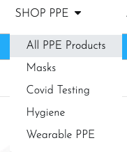
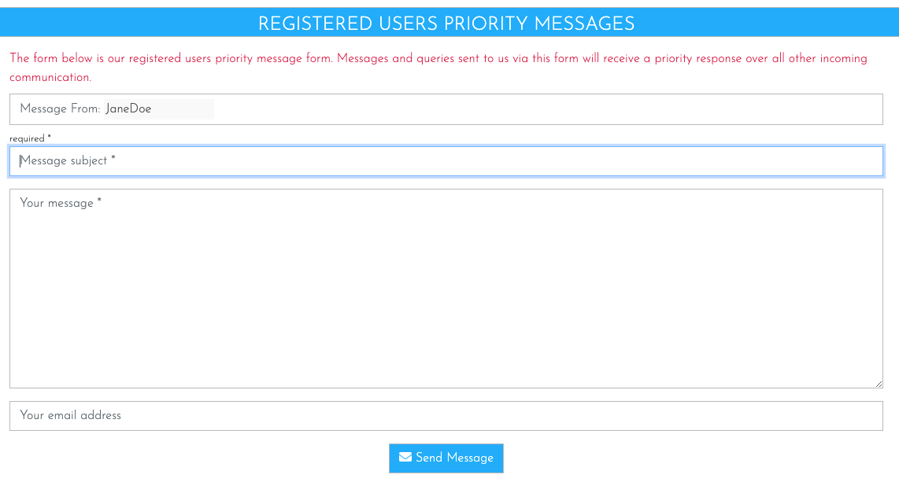

# **In Safe Hands** #

<!--  -->

## **Introduction** ##

In Safe Hands was created and built by Stephen Mc Govern as my 4th and final milestone project for my fullstack diploma in software development with Code Institute. The website is a Django e-commerce website for a company that provides different types of PPE products and equipment to the general public as well as several COVID-19 specific items. Users of the site are able to purchase products whether they are registered users or if they wish to checkout as a guest. Registered users however benefit from more access to certain features on the site than none registered users. 

## **Table of contents** ## 

### **1. User Experience (UX)** ###
* 1.1 Target audience
* 1.2 Visitor goals
* 1.3 User stories
* 1.4 Design choices
* 1.5 Wire frames

### **2. Features** ###
* 2.1 Top header
* 2.1 Navbar
* Payment processing spinner

### **3. Technologies/Languages Used** ###
* 3.1 Gitpod
* 3.2 HTML5
* 3.3 CSS
* 3.4 JavaScript
* 3.5 JQuery
* 3.6 Python
* 3.7 Django
* 3.8 Bootstrap 
* 3.9 Google fonts
* 3.10 Font Awesome
* 3.11 W3schools
* 3.12 Balsamiq 
* 3.13 Favicon Generator

### **4. Testing** ###
* 4.1 See [testing.md](testing.md) document
* 4.2 Development Issues

### **5. Deployment** ###
* 5.1 Deployment & cloning

### **6. Credits** ###
* 6.1 Media
* 6.2 Code 
* 6.3 Acknowledgements

### **7. Contact Me** ###
* 7.1 LinkedIn
* 7.2 Email
* 7.3 Skype

### **8. Future Features To Develop** ###

### **9. Disclaimer** ###
* 9.0 Disclaimer on project

 

<strong>
1. User Experience (UX)
</strong>

 

#### **1.1 - Target Audience** ####

* The website is aimed at users who are looking to purchase various types of PPE equipment that the company provides. The website is a B2C (Business to consumer) website and is not aimed at the B2B (Business to business market) The site also provides the a large amount of the latest Covid-19 data however this data is only available for registered users.  

#### **1.2 - Visitor goals** #### 

* As a user of the site my goals are:

#### **1.3 - User Stories** ####

As the owner of the e-commerce site:

* I want to be able to offer my customers a range of various types of PPE products so i can: acquire new customers and retain regular ones who will buy their PPE products from me
* I want to be able to manage all of the items that my store sells myself so i can: Add, edit, update and remove different items quickly and easily depending on how they are selling 
* I want to offer my customers a simple, efficient and user friendly shopping experience so i can: Offer users have a good user experience on the site they will come back and provide repeat business
* I want to offer registered customers access to the latest Covid-19 data all in one place so i can: offer users a reason to come back to the site on a regular basis, they need to register to view this data so this allows me to send them email marketing to encourage them to buy and to update them on the store
* I want to encourage my users to register so i can: so they can save their details and streamline the purchasing process. Once they have registered I can also email market to this database of customers
* I want to provide a guest checkout so i can: offer users who do not wish to register the ability to still purchase from the store and checkout out in a quick and easy manner so the store doesn’t lose any potential business

As a shopper on the site:

* I want to view all of the products in the store so i can: select a product to purchase
* I want to view individual products and their details so i can: identify the price, description, product protection rating, see the product image
* I want to, at a glance, be able to keep track of my purchases at any time on the site so i can: keep track of the value of goods in my cart so i can avoid spending to much money
* I want to be able to register for an account quickly and easily so i can: have a personal account on the site if I become a regular user
* I want to be able to log in and log out quickly and easily so i can: know my account can be securely logged on and off with only a few clicks. 
* I want to be able to recover my password simply if I forget it so i can: regain access to my account 
* I want to view my profile when i wish so i can: see my order history and order details 
* I want to search for a specific product or category so i can: quickly find the item that I am looking for 
* I want to easily select the quantity of a product once I have chosen to buy it so i can: add more of the product to the cart if I choose to buy more with a few clicks 
* I want to be offered a quick and easy checkout procedure so i: don’t have to register for an account if I don’t want to and still avail of a quick and easy checkout process 
* I want to be able to fully adjust my cart before checkout: incase I decide to buy more or a product, remove a product, or have selected the incorrect amount of a product
* I want to see an order confirmation in detail once ive completed my purchase so i can: verify that everything with my order is correct
* Most importantly I want to be able to use a payment provider I feel safe with so i can: feel safe and secure that my card details will be safe with this purchase  

#### **1.4 - Design Choices** ####
 

**FONTS**

* For the website i decided to use the google font style of Josefin Sans. The idea of this typeface is to be geometric, elegant, with a vintage feeling. It is inspired by geometric sans serif designs from the 1920s. The link to the Josefin Sans font on Google Font can be found by clicking: [Here](https://fonts.google.com/specimen/Josefin+Sans#standard-styles)

**ICONS**

* I have also incorporated icons throughout the website as they offer the user a more positive and intuitive user experience. All the icons that i have used came from Font Awesome website The link to the Font Awesome website can be found by clicking: [Here](https://fontawesome.com/)

**COLOURS**

* The primary colour i decided on for the website was the colour blue, specifically the colour #1fb4ff

* 

* I chose the color blue because blue is typically associated with credibility, trust, knowledge, professionalism, cleanliness and calming. All of these qualities are valued in the medical/health industry which meant that blue was the ideal choice for this project.

* For the secondary colours i used the website Coolors to decide on which additional colour combination to use. Coolors is free website that uses a generator to run through different colours and palettes that will match and compliment the colours you have selected so far. The website can be found by clicking this link: [Click Here](https://coolors.co/)

* The full palette of colours i decided on to go with can be viewed below:

INSERT COLOUR PALLETTE HERE 

**IMAGES**

* Some of the imagery i used for the website was taken from Unsplash. Unsplash is a platform powered by a community of creators that have provided hundreds of thousands of their own photos for others to use in their projects free of charge as long as they abide by the Unsplash licence terms and conditons. These T&C's can be viewed by clicking [Here](https://unsplash.com/license) 

#### **1.5 - Wire Frames** ####

<strong>
2. Features
</strong>

 

#### **2.1 - Top header** ####

* The top header on the page consists of 3 separate items. The company brand/logo occupies the top left 3rd of the screen. If the user clicks on the company brand/name the user will be be brought back to the homepage.

* The center of the screen is occupied by the search bar. Here users can search for items in the store by typing in a key/search word. If that word is in the name or description of the product then the page will return a list of those products for the user to view. If there are no items that match the search/keyword then no products will be displayed on the products page and the user will see the message 0 Products found for "(search/keyword)". If the user doesn't enter a search/keyword and just presses the search button then they will be brought to the all products page where all of the products available are listed. 

* The right hand side of the header is where the user login and shopping cart are located. Here users can see at a glance if anything is in their cart and if so the value of those items.

* If they click on the user icon they will, depending on if they are logged in or not, see different account management options. 

#### **2.2 - The Navbar** ####

* The navbar is a bootstrap navbar that contains 4 separate dropdown menus to allow users to easily navigate the site. The first dropdown is the one that will allow users to shop for different type of PPE products that the site offers.   

* The second dropdown item will bring users to the about us page where user can read a bit more information about the company.

* The third dropdown is the one for up to date information on Covid-19.

* The final dropdown will bring the users to the contact us page. 

* On mobile devices the navbar will shrink and can be opened by the user if they click on the hamburger icon on the top left of the page. After clicking all of the items will again be visible for the user to navigate the site. 

#### **2. - The Shop Page** ####

* Users to the site have the ability to shop in a number of different ways ont he site. In the "Shop PPE" dropdown menu they will see 5 different categories of items the store sells. 

>All PPE Products
>Masks
>Covid Testing
>Hygiene
>Wearable PPE

* If they select "All PPE Products" they will be brought ot the products page where they can see all of the items available in the store. 

* When the user clicks on an item they are thinking of purchasing they will be brought to the product details page

#### **2. - About Us Page** ####

* This is a standard about us page you would expect to find on any business site. It has an image of 2 medial workers and a bit of text detailing about the company.

#### **2. - Covid Numbers Page** ####

* One of the features of the site is to provide users with detailed up to the minute covid-19 data and stats. Again to drive people to register this data is kept behind a registered users wall. Users are informed that to view the data they only need to register on the site and don't need to purchase any items. (Screenshot below) 

* If a user registers and comes back to the Covid Numbers page they will see the following map.

* This map offers users a huge wealth of information that is updated daily. Users can view the latest charts, maps, tables, sources and are free to download some the data. Users can use this page to see covid stats on a global, regional and country by country basis. Again by incorporating this feature into the site you are firstly making users register to see the data, and secondly you are providing them with a reason to come back and visit the site on a regular basis. The goal would be to convert some of these regular visitors into customers. If covid numbers in their country are increasing or at a high level then ths will be enough of a prompt to encourage users to spend money on the site. 

#### **2. - Contact Us Registered Messages** ####

* One of the pass criteria for this project was to "Create at least 1 form with validation that will allow users to create records in the database (In addition ot the authentication mechanism"). 

* The feature i have chosen to meet this requirement is a priority messaging service. One of the main goals of any e-commerce site is to get as many people as possible signed up and spending money. A site should always push for users to sign up, even if they don't buy something on the first visit because it still allows the site owner to email market to these registered users at a later date. 
* If an unregistered user logs onto the site and navigates to the contact us page, they will see the company contact details as you would normally expect, below that they will see a message explaining about the registered users messages function and also a link for customers to sign up (screenshot below) 

* Once a registered/logged in user comes to the site on the contact us page they will see the message box automatically displayed. 

On the form the logged in user will see the following visible fields:
> Message From (Required) 
> Message Subject (Required) 
> Message Text Box (Required) 
> Users email (None required) 

The model for this form can be found below:

`class ContactMessages(models.Model):` 
    `sender = models.ForeignKey(UserProfile, on_delete=models.CASCADE, null=True, blank=True)` 
    `subject = models.CharField(max_length=80, null=False, blank=False)` 
    `message = models.TextField(max_length=3000, null=False, blank=False)` 
    `date = models.DateTimeField(auto_now_add=True, editable=False)` 
    `contact_email = models.EmailField(max_length=254, null=True, blank=True)` 
     
    `# This will correct the spelling in Django admin to the correct plural spelling` 
    `class Meta:` 
        `verbose_name_plural = 'Contact Messages'` 
     
    `def __str__(self):` 
        `return self.subject` 

* The `sender` (Message From:) field is automatically generated depending on which user is logged in to the site. I have also made this input field disabled so the user can not adjust or alter it, this is to ensure that every message can be attached to a specific registered site user. For a better user experience the disabled feature also stops the user clicking on the name and a highlight box appearing and creating the impression the user can adjust the field. 

* The `subject`, `message` and `email` field are self explanatory. I also have a `date & time` field which isn't displayed to the user.
* This messaging service allows users to create records (messages) in the database as well as providing all of the important information a site owner needs. In the django admin panel how the messages are displayed can be seen below: 

 

This allows the site owner to keep a record of messages from registered users. 

#### **- Toasts** ####

* To provide for a better user experience on the site i have used Bootstrap Toasts to provide users with feedback when they commit a specific action, adding an item to the cart for example. I have tried out several different toasts that incorporate images, cart totals, cart summaries and free shipping points. After trying all of these out on the site i decided i would keep the toast messaging to a small summary of each user action.

* Each toast has also been colour coded for each category of success, error, warning and info so the user will know at a glance if their action has been successful or not. 

<strong>
3. Technologies/Languages Used
</strong>

 

* 3.1 - [Gitpod](https://www.gitpod.io/) - Is the IDE recommended for Code Institute students and the one i chose to develop this project in.
* 3.2 - [HTML5](https://html.com/html5/#What_is_HTML) - This is the markup language i used for this project. 
* 3.3 - [CSS](https://en.wikipedia.org/wiki/CSS) - I used CSS to help alter and adjust the presentation of the website to create a pleasant user experience. 
* 3.4 - [JavaScript](https://en.wikipedia.org/wiki/JavaScript) - JavaScript often abbreviated as JS, is a programming language that conforms to the ECMAScript specification. Alongside HTML and CSS, JavaScript is one of the core technologies of the World Wide Web. 
* 3.5 - [JQuery](https://jquery.com/) - jQuery is a fast, small, and feature-rich JavaScript library. It makes things like HTML document traversal and manipulation, event handling, animation, and Ajax much simpler with an easy-to-use API that works across a multitude of browsers.
* 3.6 - [Python](https://www.python.org/) - Python is an interpreted high-level general-purpose programming language. Python's design philosophy emphasizes code readability with its notable use of significant indentation. Its language constructs as well as its object-oriented approach aim to help programmers write clear, logical code for small and large-scale projects.
* 3.7 - [Django](https://www.djangoproject.com/) - Django is a high-level Python web framework that encourages rapid development and clean, pragmatic design. Built by experienced developers, it takes care of much of the hassle of web development, so you can focus on writing your app without needing to reinvent the wheel. It’s free and open source.
* 3.8 - [Bootstrap](https://getbootstrap.com/) - Bootstrap is a free and open-source CSS framework directed at responsive, mobile-first front-end web development. It contains CSS- and JavaScript-based design templates for typography, forms, buttons, navigation, and other interface components.
* 3.9 - [Google fonts](https://fonts.google.com/) - Launched in 2010 Google Fonts is a library of 1,023 free licensed font families. For this project i went with the google font of Josefin Sans.
* 3.10 - [Font Awesome](https://fontawesome.com/) - Font awesome is world's most popular and easiest to use icon set. Users have access to thousands of different icons that will cover nearly every icon you are looking for and incorporating them into your website is very easy. 
* 3.11 - [W3schools](https://www.w3schools.com/) - One of the first ports of call for any developer. It has a vast amount of content and code tutorials that will help explain how code works. A great free resource for every developer. 
* 3.12 - [Balsamiq](https://balsamiq.com/) - Balsamiq Wireframes is a small graphical tool to sketch out user interfaces for websites and web / desktop / mobile applications. I used Balsamiq to formulate my initial ideas for the site so i could visualize how the site would look and also be able to gage the scope of the project. 
* 3.13 - [Favicon](https://favicon.io/favicon-generator/) - A free and simple website that allows you to create, build and customize your Favicons for your own site.

<strong>
4. Testing
</strong>

 

#### **4.1 The testing.md file** ####

* Testing information can be found in the [testing.md](testing.md) file.

#### **4.2 Development Issues** ####
 

**1. SECRET_KEY Issue**

**PROBLEM**

* When I began building the project I started to make commits to Github. After making some commits I received an email from Django saying I had inadvertently exposed my secret key. The email I received is below. 

* "GitGuardian has detected the following Django Secret Key exposed within your GitHub account."

Details
- Secret type: Django Secret Key
- Repository: smcgdub/MS4_In_Safe_Hands
- Pushed date: September 6th 2021, 16:42:54 UTC

#### **Solution** ####

* To rectify this I discarded the secret key that was initially created during the project set up. I then replaced the secret key with the code on line 25 of the settings.py file which is: `SECRET_KEY = os.environ.get('SECRET_KEY')`

* I then created a brand new secret key and have stored this in my Gitpod variables. I stopped and restarted the workspace and ran the project using `python3 manage.py runserver` Everything is now running as normal and the new SECRET_KEY is secured and no longer exposed and the old one has been discarded. 

**2. Toasts Issue**

**PROBLEM**

* During development i was going to use the Bootstrap toasts to provide feedback to a user when they completed various actions on the site. The Boutique Ado project provided some tutorials on how to install these. However when i followed the Boutique Ado tutorial i found that my toasts were not being displayed when i added an item to the shopping cart.

**SOLUTIONS TRIED**

* The first thing i did was to inspect the page after adding an item to the checkout to see if the element was being generated. The 2 screenshots below confirmed that the elements were in fact being generated. 

* The screenshot below also shows that the item was added to the cart and the information was being generated, but just wasn't displaying. 

* Once i knew the element was being generated i looked on Google and Bootstrap as to why this might not have been generated. I also checked on slack. After speaking with tutor support the solution we found was i needed th change the ``

* I have tested the site and this appears to have resolved the issue. The toasts are displaying as normal. 

**3. Stripe Card Font**

**PROBLEM**

* The placeholder text in the credit card input on the checkout page isn't set to the same font as the rest of the site. I have tried to set this to the font used on the rest of the site which is "Josefin Sans" however the font seems to always load as the back up font which is "Sans-serif". 

**SOLUTIONS TRIED**

I know i have the settings correct as i have tried to change the font from "Josefin Sans" to a more common one such as "Times New Roman". When i test this change it does take effect on the placeholder text. But when i set it to "Josefin Sans" the font always seems to revert to the back up font of "Sans-serif". It is something i am aware of and will try to work on a solution at a later date. 

<strong>
5. Deployment
</strong>

<strong>
6. Credits
</strong>

 

#### **6.1 Media** ####

The products PNG images i have sourced from various free PNG sites. The individual list of the images can be found below

**HOMEPAGE IMAGE**

* Link to the original image: [Here](https://unsplash.com/photos/fy8WmFBIaRs)
* All credits belongs to the owner of the image [(Junior REIS)](https://unsplash.com/@juniorreisfoto) and the image is free to use under the Unsplash License

**ABOUT US**

* Link to the original image: [Here](https://unsplash.com/photos/rE6FqsyyqwM)  
* All credits belongs to the owner of the image [(Usman Yousaf)](https://unsplash.com/@usmanyousaf) and the image is free to use under the Unsplash License

**PRODUCTS**

* **N95 Mask** 
Link to the original image: [Here](https://www.pngwing.com/en/free-png-itipy)
All credits belongs to the owner of the image (DMCA) and the image is provided under non-commercial use

* **KN95 Mask** 
Link to the original image: [Here](https://www.pngwing.com/en/free-png-vcpqz)
All credits belongs to the owner of the image (DMCA) and the image is provided under non-commercial use

* **Surgical Mask** 
Link to the original image: [Here](https://www.pngwing.com/en/free-png-vwteu)
All credits belongs to the owner of the image (DMCA) and the image is provided under non-commercial use

* **Face Shield** 
Link to the original image: [Here](https://pngtree.com/freepng/medical-face-mask-or-shield-realistic-plastic-face-shield-side-view-transparent-plastic-helmet-covid-19-quarantine-concept_5390600.html)
 
All credits belongs to the owner of the image (Me&Art) whose profile can be found [Here](https://pngtree.com/me%26art_6843833?type=1)

* **Rapid Antigen Test** 
Link to the original image: [Here](https://pngtree.com/freepng/coronavirus-test-used-to-detect-the-corona-virus-in-humans_5870822.html)
 
All credits belongs to the owner of the image (Iwan100) whose profile can be found [Here](https://pngtree.com/iwan100_28265876?type=1)

* **Rapid PCR Test** 
Link to the original image: [Here](https://pngtree.com/freepng/rapid-test_6581523.html)
 
All credits belongs to the owner of the image (Best Pixel) whose profile can be found [Here](https://pngtree.com/best-pixel_32692878?type=1)

* **Infrared Thermometer** 
Link to the original image: [Here](https://pngtree.com/freepng/infrared-thermometer-design-vector-cartoon_5510126.html)
 
All credits belongs to the owner of the image (p4pranstudio) whose profile can be found [Here](https://pngtree.com/p4pranstudio_18640515?type=1)

* **Disposable Gloves** 
Link to the original image: [Here](https://www.pngwing.com/en/free-png-viuej)
 
All credits belongs to the owner of the image (DMCA) and the image is provided under non-commercial use

* **Disposable Gown** 
Link to the original image: [Here](https://www.pngwing.com/en/free-png-xfpch)
 
All credits belongs to the owner of the image (DMCA) and the image is provided under non-commercial use

* **Hand Sanitizer** 
Link to the original image: [Here](https://www.pngwing.com/en/free-png-texpw)
All credits belongs to the owner of the image (DMCA) and the image is provided under non-commercial use

* **75% Alcohol wipes** 
Link to original image: [Here](https://pngtree.com/freepng/yellow-and-blue-contrast-disinfection-wipes-3d-element_5487423.html)
 
All credit belongs to the owner of the image (Air), whose profile can be found [Here](https://pngtree.com/air_14779142?type=1)

#### **6.2 Code** ####

* All of the data on the Covid numbers page is provided by Our World In Data. All credit for the charts, map, table and daily statistics goes to Our World Data who allow for the reproduction of this data free of charge once it is credited and the source is listed. The original link to the source of the data can be found by clicking here: https://ourworldindata.org/grapher/daily-covid-cases-deaths?tab=map&country=~OWID_WRL 
* The payment processing spinner that i used on the checkout page was generated from the website [Loading.io](https://loading.io/) 
* Loading.io offers both a free and paid service for creating simple animations for users to use on their sites and projects. The icon i used was a free one and is allowed to be used for projects as long as the credit for them is given which i am giving here in this section.  

#### **6.3 Acknowledgements** ####

* Thank you to all of the tutor team at Code Institute who were always on hand whenever i needed their support.
* A big thank you to my mentor Dick Vlaanderen who always gives me great feedback on my ideas and is able to point me in the right direction.
* A final big thank you to all of the other students, CI alumni and CI staff who were always willing to help out and advise on the official CI Slack channels.

<strong>
7. Contact Me
</strong>

 
If you need to reach me i can be contacted via the three methods below:

* 7.1 - [LinkedIn](https://www.linkedin.com/in/stephenmcgovern01/)
* 7.2 - [Email](mailto:stephen_xyz1@hotmail.com) 
* 7.3 - [Skype](https://join.skype.com/invite/ndruMu7qVuKZ)

<strong>
8. Future Items To Develop

 

#### **8.1 - Social media login** ####
* One of the features i will be incorporating at a later date is to enable users to be able to log in using their social media accounts such as Facebook and Google.

#### **8.2 - Social media share buttons** ####
* This feature will go on the product details pages, if a user to the site sees an item they like they will have the ability to share this with other people with only a few clicks. 

</strong>

<strong>
9. Disclaimer
</strong>

 

* This website and all of its content was completed for my final assessment project with Code Institute. The site is strictly for educational purposes only.

