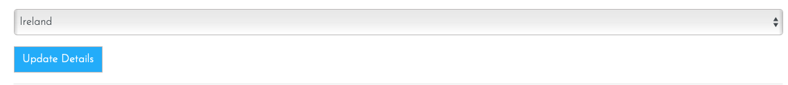
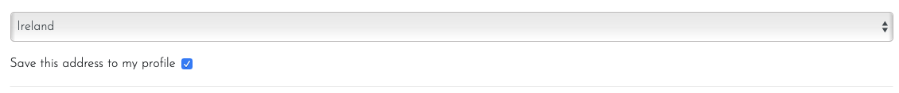
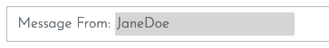

# **Tipsy Mac Staggers - Testing** #

## **Table of contents** ##

### **1. Automated Testing** ###

* 1.1 HTML Code Validating
* 1.2 CSS Code Validating 
* 1.3 JavaScript Validating
* 1.4 Python Validating
* 1.5 Django Tests

### **2. Manual Testing** ###

* 2.1 Manual testing desktop
* 2.2 Manual testing mobile

### **3. Responsiveness** ###

* 3.1 Chrome Dev Tools
* 3.2 Responsive Design Checker

### **4. Console Testing** ###

* 4.1 Console test results

<strong>
1. Automated Testing
</strong>

 

#### **1.1 HTML Code Validating** ####

* All of the HTML files were tested on the [W3C HTML Markup Validation website](https://validator.w3.org/) 
* The results from the test were as follows: 

**On all pages warning** 
* On all pages on th site the HTML checker highlights a warning saying an error saying there is a duplicate of the id "user-options" however this is incorrect and can be ignored. This item is showing in the My Account dropdown in the base.html file and also the mobile-top-header.html file. These are the same items however one of them is for the desktop and one is for the mobile. They both have the exact same functionality and are the same item. There is no effect on the functionality of the site and i have noted this here in the readme to note i am aware of it. 

**1. Homepage (home/templates/home/index.html)**
* Apart from the warning message at the top of this section all the HTML passes with no errors.

**2. Products logged in and none logged in user(products/templates/products/products.html)**
* Apart from the warning message at the top of this section all the HTML passes with no errors. 

**3. Product details logged in and none logged in user (products/templates/products/product_details.html)**
* The warning message at the top of this section is on this page. 
* There is also 1 other error displaying (Screenshot below) however this is incorrect.

 

* When i check my code i can see there is an opening `
` tag on line 160. This error from the HTML checker has been noted here to say i am aware of it but there is a matching `
` opening tag to the `
` closing tag highlighted here.

**4. About us (about_us/templates/about_us/about_us.html)**
* Apart from the warning message at the top of this section all the HTML passes with no errors. 

**5. Covid Info details logged in and none logged in user (covid_numbers/templates/covid_numbers/covid_numbers.html)**
* Apart from the warning message at the top of this section all the HTML passes with no errors. 

**6. Contact us none logged in user (contact_us/templates/contact_us/contact_us.html)**
* Apart from the warning message at the top of this section all the HTML passes with no errors. 

**7. Contact us logged in user (contact_us/templates/contact_us/contact_us.html)**
* The warning message at the top of this section is on this page. 
* At the top of the registered users priority messaging service there is an input box that is disabled. This input field is so when a registered user sends a priority message to the site the admin can tell who the message came from, the same way an email display's who an email is from. 

* The HTML checker is saying there is an error as a placeholder can only be used on certain fields. I checked with tutor support when developing this feature and they said the current way this is set is fine. This highlighted error in no way effects the functionality of the site and tutor support helped me to get this feature working. I have highlighted it here in the testing to say i am aware of it. 

**8. Signup (templates/allauth/account/signup.html)**
* Apart from the warning message at the top of this section all the HTML passes with no errors. 

**9. Login (templates/allauth/account/login.html)**
* Apart from the warning message at the top of this section all the HTML passes with no errors. 

**10. Cart (cart/templates/cart/cart.html)**
* Apart from the warning message at the top of this section all the HTML passes with no errors. 

**11. Checkout (checkout/templates/checkout/checkout.html)**
* Apart from the warning message at the top of this section all the HTML passes with no errors. 

**12. Checkout Success (checkout/templates/checkout/checkout_success.html)**
* Apart from the warning message at the top of this section all the HTML passes with no errors. 

**12. User Profile (profiles/templates/profiles/profiles.html)**
* Apart from the warning message at the top of this section all the HTML passes with no errors. 

**13. Password Reset (templates/aullauth/account/password_reset.html)**
* Apart from the warning message at the top of this section all the HTML passes with no errors. 

#### **1.2 CSS Code Validating** ####
* The main CSS files were tested on the [W3C CSS  Validation website](https://jigsaw.w3.org/css-validator/) 
* The results came back as no errors of any kind showing

#### **1.3 JavaScript Code Validating** ####
* The testing for the script.js file was carried out on [JShint.com](https://jshint.com/) The results from the test were as follows: 

**1. cart/templates/cart/cart.html**
* Results: The JavaScript at the bottom of this file is passing in JShint with no errors. 

**2. stripe_elements.js file**
* Results: JShint is saying that the code on line 3 `var stripe = Stripe(stripePublicKey);` Stripe (with the capital letter) is undefined. This code however is taken from the Stripe official docs so i have noted this here but the code is correct according to the stripe docs. 

**3. products/templates/products/includes/quantity_input_script.html**
* Results: The JavaScript in this file is passing in JShint with no errors.

**4. templates/base.html**
* Results: The JavaScript in this file is passing in JShint with no errors.

#### **1.4 Python Code Validating** ####

* The testing for the python files were carried out on [pep 8 online](http://pep8online.com/) The results from the test were as follows: 

* <strong>Results:</strong> All of the python code has passed the pep8 checks. There are however some lines of code that showed up during flake8 testing that have showed up as needing adjusting. Some of these items from Flake8 i have ignored, the reason for each of these can be found below:

1. Main settings.py file - Some of the lines are highlighted as being greater than 79 characters, however the code highlighted was created when i created the project and are the set up settings Django created, therefore i will be ignoring these as i did not write them and don't want to adjust them if they were automatically set up this way. 

2. Some of the app files that i didn't do any coding in, for example about_us/admin.py Flake8 is saying `'django.contrib.admin' imported but unused` Again i am aware of these notifications but i have chosen to leave the file in place is rather than delete it or have a blank file. 

3. Finally the bulk of the Flake 8 items highlighted are from files that are automatically generated such as migrations. Again i will be leaving these and not adjusting them as they were not created by me and are run this way by Django.

* The remainder of the items highlighted can be seen below:

4. Reviews > forms.py > line 2: `django.forms.ModelForm' imported but unused`

* Im unsure why this is displaying as ModelForm is used in my code on line 7: `class ProductReviewForm(forms.ModelForm):`

* I am aware of this in Flake 8 and have left it as it is.

5. Home > tests.py line 1: `django.test.Client imported but unused`
* Im unsure why this is displaying as i have used client in my code `response = self.client.get('')`. I am aware of this in Flake 8 and have left that file as it is.

6. Contact Us > models.py > line 2: `django.forms' imported but unused`

* I have left this in place as that model is the priority messages model and that is a form people use to send priority messages to the site. I am aware of this in Flake 8 and have left that file as it is.

7. Contact us > forms.py > line 2: `django.forms.ModelForm' imported but unused`

* Im not sure why this is displaying as i do use ModelForm in my code on line 7: `class ContactMessagesForm(forms.ModelForm):` 
* I am aware of this in Flake 8 and have left that file as it is.

8. Checkout > webhooks.py > line 43 `'payment_intent.payment_failed': handler.handle_payment_intent_payment_failed,`

* I have looked at adjusting this but was getting syntax errors when i tried. As my project deadline in a few hours i have noted here that i am aware of it and will work to resolve it at a later date.  

9. Checkout > models.py > line 69: `self.delivery_cost = self.order_total * settings.STANDARD_DELIVERY_PERCENTAGE / 100`

* I have tried to place a pair of parentheses after the = and split this line into 2 lines as you can line break after the parentheses 

`self.delivery_cost = (` 
&nbsp; &nbsp; &nbsp;`self.order_total * settings.STANDARD_DELIVERY_PERCENTAGE / 100)`

* However that still leaves the line as 80 characters once you allow for the correct indentation therefore i have left it as one single line. It is something i am aware of but leaving this line as one line doesn't effect the functionality of the site so i have noted here int he readme i am aware of it but have left it as it is on one line.

10. Checkout > apps.py Line 9: `checkout.signals imported but unused`
* This code i followed as part of the boutique ado tutorial as part of the checkout configuration and it is necessary for the functionality of the site. I have noted here i am aware of it but have left it as it is.  

12. Products > views.py > line 58 

`queries = Q(name__icontains=query) | Q(description__icontains=query)`

* This line of code comes in at greater than 79 characters, i have adjusted the code using a \ to go to a new line, example below:

`queries = Q(name__icontains=query) | \` 
&nbsp; &nbsp; &nbsp;`Q(description__icontains=query)`

* This has resolved the line length issue and I have tested the site after this adjustment and the search functionality has not changed and is working as intended. 

13. Reviews > forms.py > ModelForm imported but unused

* This is incorrect as the ModelForm is part of my ProductReviewForm code. I have noted it here i am aware of it in Flake but have left it. 

14. Products > widgets.py > line 9 

`template_name = 'products/custom_widget_templates/custom_clearable_file_input.html'`

* This line of code comes in at greater than 79 characters. As with item 1 on this list i have wrapped the code after the = in parentheses and split it onto 2 lines, example below:

`template_name = (` 
&nbsp; &nbsp; &nbsp;`'products/custom_widget_templates/custom_clearable_file_input.html')`

* This has resolved the line length issue and I have tested the site after this adjustment and the search functionality has not changed and is working as intended. 

#### **1.5 Django Tests** ####

* I have created automated Django tests in each django app in this project. The tests can be found in the tests.py file in each app. You can run all of the django tests in the terminal all at once by running the command `python3 manage.py test` or you can run the tests app by app. To run a specific app test, about us for example,  you would run the command `python3 manage.py test about_us`

**NOTE:** 

* If you are going to run the Django tests you will need to make an adjustment in the main settings.py file. The current setting for the DATABASE in the settings .py file is currently (Screenshot below)

* However if i try and run the tests with that current configuration i get a message in terminal saying `Got an error creating the test database: permission denied to create database`

* I have spoken to tutor support at Code Institute and they said that this may be caused by `DATABASE_URL` being stored as an Environment Variables in my Gitpod. They said i could delete it and it may resolve the testing issue, however that variable is needed for the updating of the postgress database as i am using fixtures files and i use the command `loaddata` to update the postgress database. Tutor support said if the `DATABASE_URL` variable is deleted from my Gitpod Environment Variables then that functionality would cease working. 

* To get the tests running its a simple case of commenting out the if else: block of code like in the screenshot below:

* and copying and pasting the else part of the code and ensuring correct indentation. The code should look like the code in the screenshot above:

* You can now save the settings.py file, run the tests, and you will see all of them running and the results in terminal, i have around 50 tests written so far. (Screenshot below)

* My submission deadline for this project is in the next few hours. I would ideally like to spend more time resolving this issue for a better solution however the tutor who was helping me on this said they were unable to think of a solution other than the one listed here and it would be best to just list this in the testing.md document to let the assessor know i am aware of the issue however due to time constraints this is the best solution we could devise with the deadline we have.  

<strong>
2. Manual Testing
</strong>

 

#### **2.1 Manual testing desktop** ####

* All desktop testing was carried out on Chrome, FireFox, Opera and Safari. Results listed below will apply to all browsers unless highlighted as otherwise. 

**1. The Home Page**

* The homepage is rendering correctly on all of the browsers as intended.
* Clicking the In Safe Hands name in the top left brings the user back to the home page
* Clicking the search bar without entering an item to search for brings the user to the all products page and the correct toast displays the message in the top right of the screen. 
* The dropdown menus are all expanding when clicked and showing the correct sub menu options
* I have clicked on every option in the 4x dropdown menus and all the links bring the user to the correctly specified page
* The reviews carousel on the bottom of the page is rendering and cycling through the reviews as is intended. 

**2. The My Account, Profile & Cart**

* When a user clicks on the My Account icon and clicks on the sign up option the correct sign up page is rendering
* I have clicked on sign up and followed the steps to create a new registered user on each browser. All of the accounts were able to be set up correctly as expected on all browsers.  
* When a user clicks on the My Account icon and clicks on the Log in option the correct Log in page rendering
* If a user enterers the incorrect username and/or password the page will reload with a warning message saying <strong>"The username and/or password you specified are not correct"</strong>
* If a user tries to enter just the username or just the password the the login form validation will notify them that all fields are required and they must complete all fields. 
* If a user tries to create an account with an email address that is already in use they will see an error message displayed saying that email address is already associated with another account. 
* Users can click on the forgot my password link and enter their email address to be sent the password reset link. In testing the email with the password reset link and username is sent as expected. This works on all browsers.
* I have been able to log in with the created username and password on all browsers and have been able to log out on every browser. The correct toast confirming login and logout in the top right is also generated.
* After logging in i am able to see the users profile page and order history as expected on all browsers. 

Note!
* On safari the dropdown menu for Country is displaying slightly different than on the other browsers. I have checked the functionality and it is working as normal. The difference is purely aesthetic so i am noting here that i am aware of it

* When i click on a past order number on the profile page the order details open and are all displaying correctly. 
* If i click on the cart button when the cart is empty then the correct message saying the shopping cart is empty and the link to go to the store is displaying correctly. 
* If i try and bypass this by typing checkout in the url i correctly get redirected to he products page with the warning toast saying there is nothing in your cart. 

**3. The Products Page**

* The products page is displaying all of the products for sale in the store correctly. As the user adjusts the screen size the layout is adjusting on each browser as expected.  

**4. The Product Details Page**

* All of the product details are displaying correctly as intended on all browsers. 
* When the user clicks the Read Product Reviews the collapsible expands correctly and shows the reviews on each browser. 
* If a user tries to set the quantity to 0 and add it to the cart they will see the validation error informing them the minimum number allowed is 1.
* Users can add items to the cart as expected by selecting the quantity and pressing the add to cart button. 

**5. The Cart Page**

* A user who tries to access the cart with nothing in it will get the message there is nothing in your cart and be given the option to click and be redirected back to the store
* Once the user has an item in the cart they can adjust the quantity and update the cart. The cart on all browsers reflects the update correctly
* If a user presses the remove button the item is removed from the cart
* If the user clicks on the secure checkout button the user will be brought to the checkout page 

**6. The Checkout Page**

* The checkout page is rendering correctly and the logged in users delivery address is automatically populating on all browsers. 

Note!

* Again on safari the dropdown menu for Country is displaying slightly different than on the other browsers. I have checked the functionality and it is working as normal. The difference is purely aesthetic so i am noting here that i am aware of it

* I have placed an order on each browser and the order has gone through successfully using the Stripe test card details. 

**7. The Order Confirmation Page**

* After placing an order the order confirmation page is generated and rendered correctly with all of the order details displayed as they should. 

**8. About Us Page**

* The about us page is rendering as expected on all browsers with no issues or errors. It adjusts it structure as the page size is adjusted on smaller devices. 

**9. Covid Data Page**
* When a none logged in user comes to this page they will see the message informing them the data is only available to registered users. 
* Once logged in the covid data that was behind a registered users wall is now rendering correctly on each browser. I have used this feature to drill down into the various types of information available and it is all working as intended. 

**10. Contact Us Page**
* When a none logged in user goes to the contact us page the page is displaying as it should for a none logged in user. The message about the priority message service being only available to logged in users is displaying correctly. 
* When a logged in user goes to the contact us page the contact us form is rendering as expected on all browsers. 

Error Detected!
* When a logged in user goes to the contact us page on Firefox, the username field that automatically generates the username has a grey background, this is only happening on Firefox and not on the other browsers (Screenshot below:)   

I have resolved this with the following css:  
`.user-input-display {` 
  `background: transparent;` 
`}`

* The user input field now has a white background like the rest of the browsers. 

* I have tested sending a message via the priority email messaging service on the contact us page and the message successfully goes through and is appearing in the Django admin panel as expected. 

#### **2.1 Manual testing mobile** ####
 

* To reduce repetition of the desktop results, for the mobile testing i have just highlighted the different functionalities that mobile users may experience while using the site on a mobile device. I have carried out all of the exact same manual tests on mobile devices as i did on the desktop however unless highlighted below, readers of this document can know i experienced the exact same outcomes on mobile devices as i did on desktop.  

Mobile testing was carried out on the following devices: 
1. iPhone 6/7/8 (Via Chrome Dev Tools)
2. iPad (Via Chrome Dev Tools)
3. Huawei P20 lite
4. Huawei P smart
5. Chuwi h9 pro tablet 

All mobile testing was carried out on Chrome, FireFox, Opera and Brave browsers.

Error Found - Several Pages:
* On some of the pages on the site (Login, Sign up, Products, About us page image) the content of that page was sitting right at the very bottom of the screen on tablet devices when the tablet was held horizontally. Items such as buttons, text and images were touching the very bottom of the tablet screen which doesn't give a good user experience and it made the pages look poor.  

Solution:
On pages where i have encountered this issue i have added a ` ` element at the very bottom of the code on each of the pages. Now when i reload the page there is an extra row of whitespace at he bottom which has rectified the issue. 

**1. The Home Page**

* Apart from the issue highlighted above all tests on mobile devices returned the same results as the desktop results listed above. The page is functioning normally and as intended on mobile devices. 

**2. The My Account, Profile & Cart**

* Apart from the issue highlighted above all tests on mobile devices returned the same results as the desktop results listed above. The page is functioning normally and as intended on mobile devices. 

**3. The Products Page**

* Apart from the issue highlighted above all tests on mobile devices returned the same results as the desktop results listed above. The page is functioning normally and as intended on mobile devices. 

**4. The Product Details Page**

* The page is functioning normally and as intended on mobile devices. 

**5. The Cart Page**

* The page is functioning normally and as intended on mobile devices. 

**6. The Checkout Page**

* The page is functioning normally and as intended on mobile devices. 
* One thing to note is on Google Chrome when the user clicks on the credit card details input field to enter their card number, the browser will automatically zoom into that field to help make entering the card details easier. When the user presses the button to complete the purchase they wont see the payment processing spinner. The processing spinner is still there and is still being generated correctly, whats happening is if the user doesn't zoom back out after entering their credit card details when they press the button to complete the transaction the screen will stay zoomed in on the bottom corner. 

**7. The Order Confirmation Page**

* The page is functioning normally and as intended on mobile devices. 

**8. About Us Page**

* Apart from the issue highlighted above all tests on mobile devices returned the same results as the desktop results listed above. The page is functioning normally and as intended on mobile devices. 

**9. Covid Numbers Page**

* The page is functioning normally and as intended on mobile devices. 

**10. Contact Us Page**

* The page is functioning normally and as intended on mobile devices. 

<strong>
3. Responsiveness
</strong>

 

**3.1 Chrome Dev Tools**
* I have checked the site on google dev tools for responsiveness on screen sizes ranging from a maximum size of 1870px X 767px down to a minimum of 320px X 480px. The site is functioning as intended. 

**3.2 Responsive Design Checker**
* I have also checked the site on the website [Responsive Design Checker](https://responsivedesignchecker.com/) on all of the pages that are available and the site is functioning as intended. 

**NOTE** 
* The cart on my site isn't as mobile friendly as i would like it to be. Users on smaller screens will have to side scroll which isn't ideal, but the functionality is there. I will address the layout of this page at a later date. Check section 8 of the readme.md features to develop.

<strong>
4. Console Testing
</strong>

* There is one error that is appearing on every page and that is the favicon error (Screenshot below)

* It is pointing to line 1 and column 1 in the favicon ico file. When i click into this file to see where the error is ii can see the following code: 

1. **Covid Info Page** 

* On the covid info page when a logged in user is viewing the data in the console there is an message (Not an error or warning) saying `[bugsnag] Loaded1`

* I have inspected this further and it is something to do with the internal code of the covid data that i importing into the site (Screenshot below) and nothing to do with any of my code. As i am unable to adjust any of the code in the covid data i have listed it here to notify i am aware of it.

2. **Contact Us Page**

* There is a message generated on the contact us page in relation to the google map (Screenshot below): 

* This is neither a warning message or an error and its related to the google map code. Due to an imminent deadline for this project i will not have time to resolve it before submission. This is to confirm i am aware of it and can confirm it has no effect on the functionality of the site. 

2. **Sign Up Page**

* There is a message in the console for this page. The message is recommending the input elements should have autocomplete added to them. Again due to an imminent deadline for this project i will not have time to work on this before submission. This is to confirm i am aware of it and can confirm it has no effect on the functionality of the site. 

2. **Stripe Checkout Page**

* When the user goes to the checkout page to make a payment the error message below from stripe appears in the console. 

* I have drilled into these errors and they are not being caused from any errors in the code that i have written. I have noted the error here in the testing document to confirm that i am aware of this error and it has no effect on the functionality of the site or stripe payments. I will aim to investigate this issue further. 

